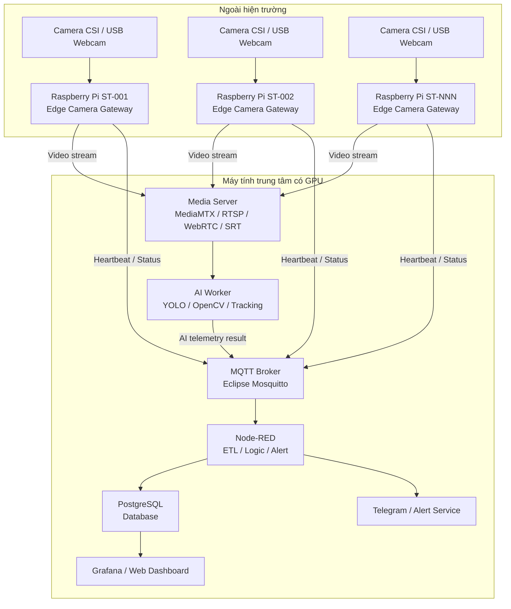
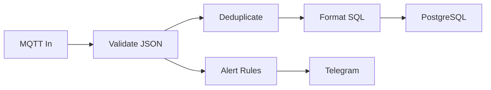
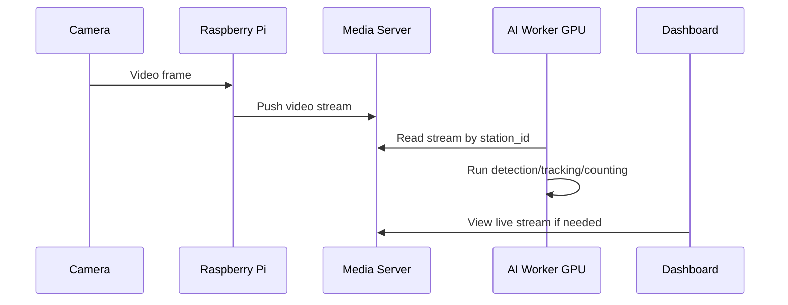
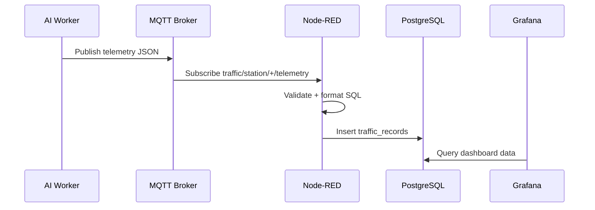
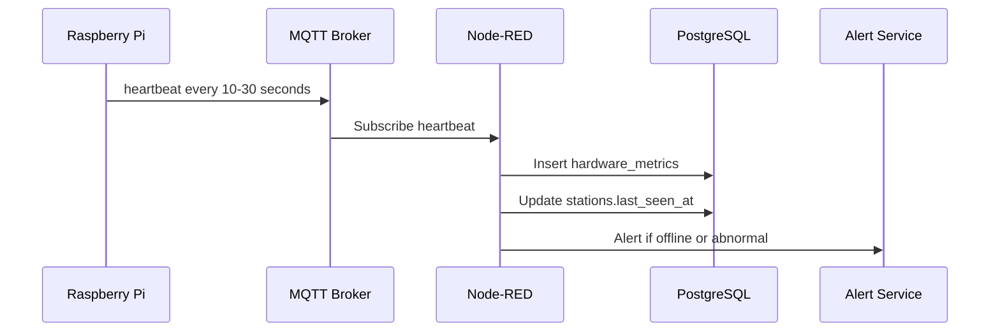
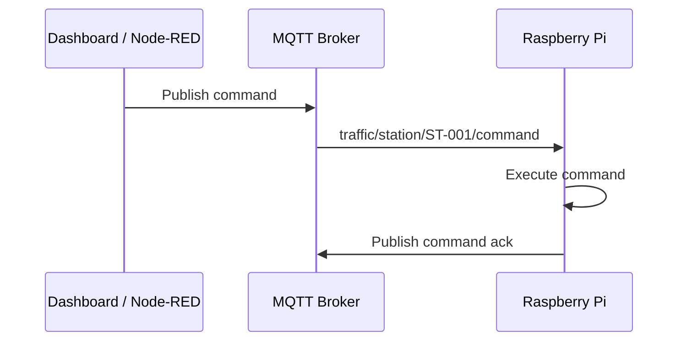

# Kế hoạch hệ thống AI Camera Dashboard dùng Raspberry Pi làm Edge Camera Gateway

**Tên hệ thống đề xuất:** AI Camera Dashboard – Multi Raspberry Pi Streaming Architecture  
**Vai trò chính:** Raspberry Pi truyền hình ảnh/video thời gian thực, máy tính GPU xử lý AI và chạy dashboard  
**Bối cảnh đồ án:** Hệ thống camera giao thông/giám sát thông minh, hỗ trợ nhiều trạm Raspberry Pi gửi video về một máy chủ trung tâm có GPU để xử lý AI, lưu dữ liệu và hiển thị dashboard.

---

## 1. Mục tiêu tổng thể

Mục tiêu của hệ thống là xây dựng một kiến trúc camera AI có khả năng mở rộng, dễ bảo trì và phù hợp triển khai thực tế ngoài đường.

Trong kiến trúc này:

- Raspberry Pi không xử lý AI.
- Raspberry Pi chỉ đóng vai trò thiết bị ngoài hiện trường để:
  - nhận hình ảnh từ camera;
  - truyền video thời gian thực về server;
  - gửi trạng thái thiết bị;
  - nhận lệnh cấu hình từ server nếu cần.
- Máy tính có GPU đóng vai trò trung tâm để:
  - nhận video từ nhiều Raspberry Pi;
  - chạy AI nhận diện/phân loại/đếm phương tiện;
  - lưu dữ liệu vào database;
  - hiển thị dashboard;
  - quản lý nhiều trạm camera;
  - gửi cảnh báo khi có lỗi.

Triết lý thiết kế quan trọng:

> Raspberry Pi càng mỏng càng tốt, server trung tâm càng thông minh càng tốt.

Lý do là khi Raspberry Pi đã lắp ngoài đường, việc sửa chữa, cập nhật, debug trực tiếp rất khó. Vì vậy toàn bộ logic phức tạp như AI, dashboard, database, thuật toán, cảnh báo nên đặt ở máy chủ trung tâm.

---

## 2. Kiến trúc tổng quan



---

## 3. Phân chia trách nhiệm hệ thống

### 3.1 Raspberry Pi

Raspberry Pi là thiết bị ngoài hiện trường.

Nhiệm vụ chính:

1. Nhận hình ảnh/video từ camera.
2. Mã hóa video ở mức nhẹ.
3. Stream video thời gian thực về máy chủ GPU.
4. Gửi heartbeat định kỳ lên MQTT.
5. Báo trạng thái phần cứng:
   - nhiệt độ CPU;
   - RAM còn trống;
   - dung lượng ổ đĩa;
   - camera có hoạt động không;
   - mạng có ổn không;
   - uptime.
6. Nhận lệnh từ server:
   - restart stream;
   - đổi độ phân giải;
   - đổi FPS;
   - đổi bitrate;
   - reboot thiết bị nếu cần.
7. Tự khởi động lại service khi lỗi.
8. Không chạy AI.
9. Không chạy database.
10. Không chạy dashboard.
11. Không chạy Node-RED.
12. Không chạy Grafana.

Raspberry Pi nên được xem như một **camera gateway**, không phải server chính.

---

### 3.2 Camera

Camera có thể là:

- Raspberry Pi Camera CSI;
- USB Webcam;
- IP Camera;
- camera module khác tương thích Linux.

Nhiệm vụ:

- cung cấp video raw hoặc compressed cho Raspberry Pi;
- hoạt động ổn định trong thời gian dài;
- hỗ trợ độ phân giải phù hợp, ví dụ:
  - 640x480;
  - 1280x720;
  - 1920x1080.

Đối với đồ án, nên ưu tiên:

- 720p, 20–30 FPS cho demo mượt;
- 1080p nếu mạng và server đủ mạnh;
- 640x480 nếu cần giảm băng thông.

---

### 3.3 Máy tính GPU / Server trung tâm

Máy tính GPU là trung tâm xử lý chính.

Nhiệm vụ:

1. Nhận video stream từ nhiều Raspberry Pi.
2. Quản lý stream theo từng `station_id`.
3. Chạy AI inference bằng GPU.
4. Tracking và đếm phương tiện.
5. Publish kết quả AI lên MQTT.
6. Lưu dữ liệu vào PostgreSQL thông qua Node-RED.
7. Hiển thị dashboard.
8. Quản lý trạng thái online/offline của từng Raspberry Pi.
9. Gửi cảnh báo khi:
   - Raspberry Pi mất kết nối;
   - camera mất hình;
   - nhiệt độ quá cao;
   - stream lỗi;
   - AI worker bị crash;
   - không có dữ liệu trong thời gian dài.
10. Là nơi cập nhật thuật toán AI mà không cần đụng vào Raspberry Pi ngoài đường.

---

### 3.4 Media Server

Media Server là lớp nhận và phân phối video stream.

Đề xuất dùng:

- MediaMTX;
- RTSP;
- WebRTC;
- SRT;
- HLS nếu cần xem browser với latency cao hơn.

Nhiệm vụ:

- nhận stream từ Raspberry Pi;
- đặt mỗi stream theo một path riêng;
- cho AI worker đọc video;
- cho dashboard/web xem live video;
- có thể record stream nếu cần;
- gom nhiều camera vào một điểm trung tâm.

Ví dụ stream path:

```text
rtsp://GPU_SERVER_IP:8554/ST-001
rtsp://GPU_SERVER_IP:8554/ST-002
rtsp://GPU_SERVER_IP:8554/ST-003
```

---

### 3.5 AI Worker

AI Worker chạy trên máy GPU.

Nhiệm vụ:

1. Đọc video stream từ Media Server.
2. Chạy model AI, ví dụ:
   - YOLOv8;
   - YOLOv10;
   - YOLOv11;
   - model custom.
3. Phân loại đối tượng:
   - motorbike;
   - car;
   - truck;
   - bus;
   - bicycle;
   - unknown.
4. Tracking đối tượng để tránh đếm trùng.
5. Tính toán:
   - tổng số xe;
   - số xe theo từng loại;
   - hướng di chuyển nếu có;
   - FPS;
   - inference time;
   - confidence trung bình;
   - trạng thái ánh sáng.
6. Publish dữ liệu kết quả lên MQTT topic tương ứng.

Ví dụ topic:

```text
traffic/station/ST-001/telemetry
```

Ví dụ payload:

```json
{
  "v": 1,
  "station_id": "ST-001",
  "timestamp": 1780000000,
  "seq": 15,
  "interval_seconds": 10,
  "data": {
    "vehicles": {
      "motorbike": 25,
      "car": 6,
      "truck": 2,
      "bus": 1,
      "bicycle": 3,
      "unknown": 0
    },
    "total": 37,
    "direction": {
      "inbound": 18,
      "outbound": 19
    },
    "avg_confidence": 0.89,
    "min_confidence": 0.61,
    "detections_raw": 81,
    "detections_filtered": 37,
    "lighting_condition": "day"
  },
  "status": {
    "fps": 24.5,
    "inference_ms": 31,
    "stream_status": "ok"
  }
}
```

---

### 3.6 MQTT Broker

MQTT dùng để truyền dữ liệu nhẹ, không dùng để truyền video lớn.

Nhiệm vụ:

- nhận heartbeat từ Raspberry Pi;
- nhận kết quả AI từ AI Worker;
- nhận alert;
- gửi command/config xuống Raspberry Pi;
- làm cầu nối giữa edge node, AI worker và Node-RED.

Các topic đề xuất:

```text
traffic/station/+/telemetry
traffic/station/+/heartbeat
traffic/station/+/alert
traffic/station/+/watchdog
traffic/station/+/network_quality
traffic/station/+/snapshot
traffic/station/+/command
traffic/station/+/config
traffic/station/broadcast/command
traffic/server/status
```

Quy ước:

- `telemetry`: kết quả AI sau xử lý.
- `heartbeat`: trạng thái sống của Raspberry Pi.
- `alert`: cảnh báo.
- `watchdog`: sự kiện reset/lỗi hệ thống.
- `network_quality`: chất lượng mạng.
- `snapshot`: ảnh snapshot nhỏ, không phải video stream chính.
- `command`: lệnh server gửi xuống một trạm.
- `config`: cấu hình server gửi xuống một trạm.
- `broadcast/command`: lệnh gửi cho toàn bộ trạm.

---

### 3.7 Node-RED

Node-RED là lớp xử lý dữ liệu trung gian.

Nhiệm vụ:

1. Subscribe MQTT topic.
2. Parse JSON payload.
3. Kiểm tra dữ liệu hợp lệ.
4. Deduplicate message nếu QoS 1 gửi trùng.
5. Insert dữ liệu vào PostgreSQL.
6. Gửi alert.
7. Tạo API phụ nếu cần.
8. Điều phối command xuống Raspberry Pi.

Luồng Node-RED:



---

### 3.8 PostgreSQL

PostgreSQL lưu dữ liệu lịch sử.

Các bảng nên có:

```text
stations
traffic_records
hardware_metrics
device_alerts
watchdog_events
network_quality
snapshots
command_log
accuracy_evaluations
```

Nhiệm vụ:

- lưu danh sách trạm camera;
- lưu dữ liệu đếm xe;
- lưu trạng thái phần cứng;
- lưu chất lượng mạng;
- lưu cảnh báo;
- lưu lịch sử command;
- lưu kết quả đánh giá độ chính xác AI.

---

### 3.9 Grafana / Dashboard

Dashboard hiển thị cho người dùng hoặc giảng viên.

Nhiệm vụ:

1. Hiển thị tổng số xe theo thời gian.
2. Hiển thị số lượng từng loại xe.
3. Hiển thị trạng thái từng trạm.
4. Hiển thị camera online/offline.
5. Hiển thị nhiệt độ Raspberry Pi.
6. Hiển thị FPS/inference time.
7. Hiển thị chất lượng mạng.
8. Hiển thị alert.
9. Hiển thị live stream nếu tích hợp WebRTC/HLS.
10. So sánh độ chính xác AI với dữ liệu đếm thủ công.

---

## 4. Luồng dữ liệu chi tiết

### 4.1 Luồng video



Video không đi vào MQTT vì video có dung lượng lớn và cần protocol chuyên dụng hơn.

---

### 4.2 Luồng dữ liệu AI



---

### 4.3 Luồng heartbeat từ Raspberry Pi



Ví dụ heartbeat:

```json
{
  "station_id": "ST-001",
  "timestamp": 1780000000,
  "status": "active",
  "uptime_seconds": 3600,
  "stream_url": "rtsp://server-ip:8554/ST-001",
  "hardware": {
    "cpu_temp_c": 57.1,
    "free_memory_kb": 6810604,
    "disk_usage_pct": 8,
    "input_voltage_v": 5.1
  },
  "network": {
    "rssi_dbm": -65,
    "latency_ms": 32,
    "packet_loss_percent": 0.5
  },
  "camera_status": "ok",
  "stream_status": "ok",
  "last_reboot_reason": "power_on"
}
```

---

### 4.4 Luồng command từ server xuống Raspberry Pi



Ví dụ command:

```json
{
  "command_id": "cmd-0001",
  "command": "restart_stream",
  "issued_at": 1780000000
}
```

Ví dụ đổi cấu hình stream:

```json
{
  "command_id": "cmd-0002",
  "command": "update_stream_config",
  "params": {
    "width": 1280,
    "height": 720,
    "fps": 20,
    "bitrate": 1800000
  }
}
```

---

## 5. Protocol đề xuất

### 5.1 Video stream

| Tình huống | Protocol đề xuất | Ghi chú |
|---|---|---|
| Demo trong cùng mạng LAN | RTSP | Dễ test, OpenCV đọc tốt |
| Raspberry Pi ngoài đường dùng 4G/NAT | SRT hoặc push stream về server | Tốt hơn khi không mở port trên Pi |
| Dashboard xem live trên web | WebRTC | Độ trễ thấp |
| Xem chậm vài giây, dễ nhúng web | HLS | Độ trễ cao hơn |
| AI worker đọc video | RTSP/SRT | Dễ dùng với FFmpeg/OpenCV |

Khuyến nghị cho đồ án ban đầu:

> Raspberry Pi push video về MediaMTX trên server. AI Worker đọc lại stream từ MediaMTX.

---

### 5.2 Metadata/control

Dùng MQTT.

MQTT phù hợp cho:

- trạng thái thiết bị;
- dữ liệu AI;
- cảnh báo;
- command;
- config;
- watchdog;
- network quality.

Không dùng MQTT để truyền video liên tục.

---

## 6. Cấu trúc repository đề xuất

Repository hiện tại nên được mở rộng theo hướng sau:

```text
ai-camera-dashboard/
├── docker-compose.yml
├── .env.example
├── README.md
│
├── mosquitto/
│   ├── mosquitto.conf
│   ├── acl.conf
│   └── passwd
│
├── nodered/
│   ├── flows.json
│   ├── package.json
│   └── settings.js
│
├── postgres/
│   └── init.sql
│
├── grafana/
│   ├── provisioning/
│   └── dashboards/
│
├── mediamtx/
│   └── mediamtx.yml
│
├── ai-worker/
│   ├── main.py
│   ├── config.example.yaml
│   ├── requirements.txt
│   └── README.md
│
├── edge-rpi/
│   ├── install.sh
│   ├── edge_agent.py
│   ├── config.example.yaml
│   ├── requirements.txt
│   ├── systemd/
│   │   ├── camera_stream.service
│   │   └── edge_agent.service
│   └── README.md
│
└── docs/
    ├── SYSTEM_PLAN.md
    ├── DEPLOYMENT_GUIDE.md
    ├── TESTING_CHECKLIST.md
    └── TROUBLESHOOTING.md
```

---

## 7. Cấu hình trên Raspberry Pi

### 7.1 OS đề xuất

- Raspberry Pi OS Lite 64-bit.
- Không cần Desktop GUI nếu chỉ chạy ngoài đường.
- Bật SSH để quản lý từ xa.
- Cấu hình hostname theo station.

Ví dụ:

```bash
sudo hostnamectl set-hostname rpi-st-001
```

---

### 7.2 Gói cần cài

```bash
sudo apt update
sudo apt upgrade -y

sudo apt install -y \
  git curl jq htop vim \
  python3 python3-venv python3-pip \
  ffmpeg \
  gstreamer1.0-tools \
  gstreamer1.0-plugins-base \
  gstreamer1.0-plugins-good \
  gstreamer1.0-plugins-bad \
  gstreamer1.0-libcamera \
  v4l-utils \
  mosquitto-clients \
  chrony
```

---

### 7.3 Python environment cho edge agent

```bash
mkdir -p ~/ai-camera-edge
cd ~/ai-camera-edge

python3 -m venv .venv
source .venv/bin/activate

pip install paho-mqtt psutil pyyaml requests
```

---

### 7.4 File cấu hình Raspberry Pi

`edge-rpi/config.yaml`:

```yaml
station_id: ST-001

server:
  host: 192.168.1.50
  mqtt_port: 1883
  mediamtx_rtsp_port: 8554

mqtt:
  username: edge_device
  password: MqttEdge2026!
  qos: 1
  keepalive: 60

camera:
  type: csi
  device: /dev/video0
  width: 1280
  height: 720
  fps: 25
  bitrate: 2500000

stream:
  protocol: rtsp
  path: ST-001
  url: rtsp://192.168.1.50:8554/ST-001
  reconnect_delay_s: 5

heartbeat:
  interval_s: 10

network:
  interface: wlan0
```

Mỗi Raspberry Pi chỉ cần thay:

```yaml
station_id: ST-001
stream.path: ST-001
```

Các phần còn lại có thể giữ chung.

---

### 7.5 Service cần chạy trên Raspberry Pi

Raspberry Pi nên có 2 service systemd:

```text
camera_stream.service
edge_agent.service
```

#### `camera_stream.service`

Nhiệm vụ:

- mở camera;
- stream video về server;
- tự restart khi lỗi.

Ví dụ service:

```ini
[Unit]
Description=AI Camera Stream Service
After=network-online.target
Wants=network-online.target

[Service]
Type=simple
User=pi
WorkingDirectory=/home/pi/ai-camera-edge
ExecStart=/home/pi/ai-camera-edge/start_stream.sh
Restart=always
RestartSec=5

[Install]
WantedBy=multi-user.target
```

#### `edge_agent.service`

Nhiệm vụ:

- gửi heartbeat;
- nhận command;
- kiểm tra trạng thái camera;
- restart stream khi server yêu cầu.

Ví dụ service:

```ini
[Unit]
Description=AI Camera Edge Agent
After=network-online.target camera_stream.service
Wants=network-online.target

[Service]
Type=simple
User=pi
WorkingDirectory=/home/pi/ai-camera-edge
ExecStart=/home/pi/ai-camera-edge/.venv/bin/python edge_agent.py
Restart=always
RestartSec=5

[Install]
WantedBy=multi-user.target
```

Enable service:

```bash
sudo systemctl daemon-reload
sudo systemctl enable camera_stream.service
sudo systemctl enable edge_agent.service
sudo systemctl start camera_stream.service
sudo systemctl start edge_agent.service
```

---

## 8. Cấu hình trên máy GPU/server

### 8.1 Thành phần cần chạy

Máy GPU/server chạy:

```text
Docker Compose stack:
- Mosquitto
- PostgreSQL
- Node-RED
- Grafana
- MediaMTX

Python/Conda/venv:
- AI Worker
```

Có thể chạy AI Worker bằng Docker GPU hoặc chạy trực tiếp bằng Python environment.

---

### 8.2 Docker Compose server mở rộng

`docker-compose.yml` nên bổ sung MediaMTX:

```yaml
services:
  mediamtx:
    image: bluenviron/mediamtx:latest
    container_name: shtp-mediamtx
    ports:
      - "8554:8554"       # RTSP
      - "1935:1935"       # RTMP
      - "8888:8888"       # HLS
      - "8889:8889"       # WebRTC HTTP
      - "8890:8890/udp"   # WebRTC UDP
      - "9997:9997"       # API
    volumes:
      - ./mediamtx/mediamtx.yml:/mediamtx.yml
    restart: unless-stopped
    networks:
      - shtp-net
```

---

### 8.3 MediaMTX config

`mediamtx/mediamtx.yml`:

```yaml
rtsp: yes
rtspAddress: :8554

rtmp: yes
rtmpAddress: :1935

hls: yes
hlsAddress: :8888

webrtc: yes
webrtcAddress: :8889

api: yes
apiAddress: :9997

paths:
  all:
    source: publisher
```

Mỗi Raspberry Pi publish stream theo path:

```text
/ST-001
/ST-002
/ST-003
```

---

### 8.4 AI Worker config

`ai-worker/config.yaml`:

```yaml
server:
  mqtt_host: localhost
  mqtt_port: 1883
  mqtt_username: nodered_service
  mqtt_password: NodeRedInternal2026!

model:
  path: models/yolo.pt
  device: cuda
  imgsz: 640
  conf: 0.35

streams:
  - station_id: ST-001
    url: rtsp://localhost:8554/ST-001
    location_name: Cong D2
  - station_id: ST-002
    url: rtsp://localhost:8554/ST-002
    location_name: Nga tu D1-D2

publish:
  interval_s: 10
  topic_template: traffic/station/{station_id}/telemetry
```

AI Worker nên đọc danh sách stream từ:

- config file trong giai đoạn đầu;
- database `stations` trong giai đoạn sau;
- MediaMTX API trong giai đoạn mở rộng.

---

## 9. Quy trình triển khai đề xuất

### Giai đoạn 1: Server chạy dashboard stack cơ bản

Mục tiêu:

- chạy được Mosquitto;
- chạy được Node-RED;
- chạy được PostgreSQL;
- chạy được Grafana;
- chạy được MediaMTX.

Thao tác:

```bash
git clone https://github.com/TuanDanny/ai-camera-dashboard.git
cd ai-camera-dashboard

cp .env.example .env
nano .env

docker compose up -d
docker compose ps
```

Kết quả cần đạt:

- Grafana truy cập được.
- Node-RED truy cập được.
- MQTT broker mở port 1883.
- PostgreSQL healthy.
- MediaMTX mở port 8554.
- Không có container restart liên tục.

---

### Giai đoạn 2: Test Raspberry Pi gửi video về server

Mục tiêu:

- Raspberry Pi capture được camera.
- Raspberry Pi stream được video về máy GPU.
- Server nhận được stream theo station path.

Kiểm tra camera:

```bash
v4l2-ctl --list-devices
```

Với CSI camera:

```bash
rpicam-hello
```

Với USB webcam:

```bash
ffmpeg -f v4l2 -list_formats all -i /dev/video0
```

Kết quả cần đạt:

- Server đọc được stream `ST-001`.
- VLC/ffplay mở được stream.
- AI Worker chưa cần chạy, chỉ cần video về ổn định.

---

### Giai đoạn 3: Test heartbeat từ Raspberry Pi

Mục tiêu:

- Raspberry Pi gửi heartbeat lên MQTT.
- Node-RED nhận được heartbeat.
- Database lưu được hardware metrics.
- Dashboard hiển thị trạng thái trạm.

Test publish thủ công:

```bash
mosquitto_pub \
  -h 192.168.1.50 \
  -p 1883 \
  -u edge_device \
  -P 'MqttEdge2026!' \
  -t traffic/station/ST-001/heartbeat \
  -m '{"station_id":"ST-001","timestamp":1780000000,"status":"active"}' \
  -q 1
```

Kết quả cần đạt:

- MQTT nhận message.
- Node-RED flow hoạt động.
- PostgreSQL có record mới.
- Dashboard biết ST-001 online.

---

### Giai đoạn 4: AI Worker đọc stream và publish telemetry

Mục tiêu:

- AI Worker đọc stream từ MediaMTX.
- Chạy detection/tracking.
- Publish kết quả lên MQTT theo format đã thống nhất.
- Node-RED lưu dữ liệu vào database.
- Dashboard hiện số xe.

Kết quả cần đạt:

- Có dữ liệu trong `traffic_records`.
- Grafana hiển thị biểu đồ real-time.
- FPS/inference time hiển thị đúng.
- Không cần sửa Raspberry Pi khi đổi model AI.

---

### Giai đoạn 5: Điều khiển Raspberry Pi từ server

Mục tiêu:

- Server gửi command xuống Raspberry Pi qua MQTT.
- Raspberry Pi nhận và thực thi command.
- Raspberry Pi gửi ack lại.

Các command tối thiểu:

```text
restart_stream
reboot_device
update_stream_config
capture_snapshot
get_status
```

Kết quả cần đạt:

- Restart stream từ dashboard/Node-RED được.
- Đổi FPS/bitrate từ server được.
- Không cần SSH vào Pi để thao tác cơ bản.

---

### Giai đoạn 6: Multi-Raspberry Pi

Mục tiêu:

- Thêm ST-002, ST-003 mà không sửa core server.
- Mỗi Pi chỉ cần config riêng.
- Dashboard tự hiển thị nhiều trạm.

Kết quả cần đạt:

- Mỗi Pi có stream path riêng.
- Mỗi Pi có heartbeat riêng.
- AI Worker xử lý nhiều stream.
- Dashboard phân biệt từng trạm.
- Trạm mất kết nối sẽ chuyển offline.

---

## 10. Kết quả cần đạt được của đồ án

### 10.1 Kết quả kỹ thuật tối thiểu

Hệ thống cần đạt:

- Raspberry Pi truyền video real-time về máy GPU.
- Máy GPU nhận video ổn định.
- AI Worker xử lý video trên GPU.
- Kết quả AI được publish qua MQTT.
- Node-RED lưu dữ liệu vào PostgreSQL.
- Grafana/Dashboard hiển thị dữ liệu real-time.
- Raspberry Pi gửi heartbeat định kỳ.
- Dashboard biết trạm nào online/offline.
- Có cảnh báo khi mất kết nối hoặc lỗi camera.
- Hệ thống có thể mở rộng thêm nhiều Raspberry Pi.

---

### 10.2 Kết quả demo nên có

Trong buổi demo, nên trình bày được:

1. Sơ đồ tổng thể hệ thống.
2. Một Raspberry Pi đang truyền video thật.
3. Máy GPU đang chạy AI.
4. Dashboard hiển thị số lượng phương tiện.
5. Dashboard hiển thị trạng thái Raspberry Pi.
6. Tắt Raspberry Pi hoặc rút camera để thấy cảnh báo.
7. Thêm một stream giả lập hoặc Raspberry Pi thứ hai để chứng minh khả năng mở rộng.
8. Giải thích rằng Raspberry Pi không xử lý AI, giúp dễ bảo trì ngoài thực địa.

---

### 10.3 Kết quả mở rộng

Nếu còn thời gian, có thể bổ sung:

- Web dashboard custom thay vì chỉ Grafana.
- WebRTC live view trong dashboard.
- Ghi hình khi phát hiện sự kiện.
- Lưu snapshot khi có alert.
- Quản lý cấu hình stream từ giao diện web.
- Tự phát hiện stream mới từ MediaMTX API.
- Tự restart AI worker khi stream lỗi.
- Phân quyền người dùng.
- Docker hóa AI Worker.
- OTA update nhẹ cho Raspberry Pi.

---

## 11. Checklist triển khai Raspberry Pi

### Phần cứng

- [ ] Raspberry Pi 5 hoạt động ổn định.
- [ ] Nguồn đủ công suất.
- [ ] Có tản nhiệt/fan.
- [ ] Camera nhận được trên Linux.
- [ ] microSD/SSD đủ tốt.
- [ ] Mạng Wi-Fi/LAN/4G ổn định.
- [ ] Vỏ bảo vệ nếu demo ngoài trời.

### Phần mềm

- [ ] Raspberry Pi OS Lite 64-bit.
- [ ] SSH bật.
- [ ] `ffmpeg` cài.
- [ ] `rpicam-apps` hoặc `v4l-utils` hoạt động.
- [ ] Python venv tạo xong.
- [ ] `edge_agent.py` chạy được.
- [ ] `camera_stream.service` chạy được.
- [ ] `edge_agent.service` chạy được.
- [ ] Tự restart sau reboot.
- [ ] Gửi heartbeat thành công.
- [ ] Stream video thành công.

---

## 12. Checklist triển khai server GPU

### Docker stack

- [ ] Mosquitto chạy.
- [ ] PostgreSQL chạy.
- [ ] Node-RED chạy.
- [ ] Grafana chạy.
- [ ] MediaMTX chạy.
- [ ] Docker compose tự restart khi reboot.

### AI

- [ ] GPU nhận đúng driver/CUDA.
- [ ] Model load được.
- [ ] AI Worker đọc được stream.
- [ ] FPS ổn định.
- [ ] Telemetry publish đúng format.
- [ ] Có log lỗi rõ ràng.
- [ ] Có reconnect khi stream mất.

### Dashboard

- [ ] Hiển thị traffic records.
- [ ] Hiển thị hardware metrics.
- [ ] Hiển thị network quality.
- [ ] Hiển thị alert.
- [ ] Hiển thị station online/offline.
- [ ] Có panel theo từng station.
- [ ] Có thời gian cập nhật real-time.

---

## 13. Tiêu chí nghiệm thu

### Mức 1: Demo cơ bản

- 1 Raspberry Pi gửi video về server.
- Server xem được video.
- AI Worker xử lý được stream.
- Dashboard hiển thị số xe.

### Mức 2: Hệ thống hoàn chỉnh

- Có heartbeat Raspberry Pi.
- Có trạng thái online/offline.
- Có database lưu lịch sử.
- Có alert khi lỗi.
- Có command restart stream từ server.

### Mức 3: Hệ thống mở rộng

- Hỗ trợ nhiều Raspberry Pi.
- Mỗi Pi chỉ cần thay config.
- AI Worker xử lý nhiều stream.
- Dashboard quản lý nhiều trạm.
- Không cần sửa Raspberry Pi khi đổi AI model.

---

## 14. Rủi ro kỹ thuật và cách xử lý

### 14.1 Mạng yếu hoặc mất kết nối

Rủi ro:

- video giật;
- stream mất;
- MQTT reconnect liên tục.

Cách xử lý:

- giảm bitrate;
- giảm FPS;
- dùng SRT thay RTSP nếu mạng ngoài đường không ổn;
- heartbeat có reconnect_count;
- server đánh dấu offline nếu quá thời gian không có heartbeat.

---

### 14.2 Raspberry Pi quá nóng

Rủi ro:

- throttle CPU;
- stream drop frame;
- service crash.

Cách xử lý:

- dùng fan/tản nhiệt;
- theo dõi `cpu_temp_c`;
- alert nếu vượt ngưỡng;
- giảm resolution/FPS.

---

### 14.3 Camera không nhận sau reboot

Rủi ro:

- service start trước khi camera sẵn sàng;
- `/dev/video0` thay đổi.

Cách xử lý:

- service chờ camera;
- retry khi không mở được camera;
- dùng udev rule nếu cần;
- log rõ lỗi camera.

---

### 14.4 AI Worker quá tải khi nhiều stream

Rủi ro:

- FPS thấp;
- inference latency cao;
- GPU full memory.

Cách xử lý:

- giới hạn số stream mỗi worker;
- batch inference nếu phù hợp;
- giảm resolution;
- chia nhiều AI worker;
- dùng queue;
- chỉ xử lý frame theo sampling, ví dụ 5–10 FPS thay vì 30 FPS.

---

### 14.5 Database lỗi schema

Rủi ro:

- Node-RED insert lỗi;
- dashboard không có dữ liệu.

Cách xử lý:

- thống nhất payload JSON với schema PostgreSQL;
- migration version rõ ràng;
- test insert bằng simulator trước;
- log lỗi SQL ra Node-RED debug.

---

## 15. Các điểm cần chỉnh trong repo hiện tại

Repo hiện tại đã có nền tốt cho phần server: Mosquitto, Node-RED, PostgreSQL, Grafana và simulator. Tuy nhiên để phù hợp kiến trúc mới, cần bổ sung/chỉnh:

1. Thêm `mediamtx/`.
2. Thêm service MediaMTX vào `docker-compose.yml`.
3. Thêm `edge-rpi/` cho Raspberry Pi.
4. Thêm `ai-worker/` cho máy GPU.
5. Sửa schema PostgreSQL nếu có cột bị lệch.
6. Sửa Node-RED flow nếu field SQL không khớp schema.
7. Thống nhất payload chuẩn cho:
   - heartbeat;
   - telemetry;
   - network_quality;
   - alert;
   - watchdog;
   - command_ack.
8. Không để Raspberry Pi chạy full dashboard stack.
9. Tách tài liệu:
   - server deployment;
   - Raspberry Pi deployment;
   - testing checklist;
   - troubleshooting.

---

## 16. Mô hình vận hành thực tế

Khi hệ thống chạy thật:

1. Raspberry Pi boot.
2. `camera_stream.service` tự chạy.
3. Raspberry Pi bắt đầu stream video về server.
4. `edge_agent.service` gửi heartbeat.
5. MediaMTX nhận stream.
6. AI Worker đọc stream.
7. AI Worker xử lý detection/tracking/counting.
8. AI Worker publish kết quả AI lên MQTT.
9. Node-RED nhận dữ liệu.
10. Node-RED lưu vào PostgreSQL.
11. Grafana/Dashboard cập nhật biểu đồ.
12. Nếu Pi lỗi, server phát hiện mất heartbeat.
13. Nếu camera lỗi, Pi gửi alert hoặc server phát hiện stream mất.
14. Người quản trị có thể gửi lệnh restart stream từ server.
15. Khi thêm Pi mới, chỉ cần cấp `station_id` và config stream path.

---

## 17. Nguyên tắc thiết kế quan trọng

### 17.1 Không phụ thuộc vào từng Raspberry Pi

Raspberry Pi ngoài đường không nên chứa logic quan trọng.

Không nên để Pi quyết định:

- thuật toán AI;
- logic dashboard;
- schema database;
- cảnh báo phức tạp;
- giao diện người dùng.

Những phần đó phải nằm ở server.

---

### 17.2 Cấu hình hóa thay vì hard-code

Mỗi Raspberry Pi phải dùng file config riêng.

Không hard-code:

- IP server;
- station ID;
- camera device;
- FPS;
- bitrate;
- username/password;
- stream path.

---

### 17.3 Có khả năng tự phục hồi

Mỗi service cần có:

- `Restart=always`;
- reconnect khi mất MQTT;
- reconnect khi mất stream;
- log rõ lỗi;
- heartbeat để server biết thiết bị còn sống.

---

### 17.4 Chuẩn hóa dữ liệu từ đầu

Payload phải thống nhất để sau này nhiều AI model hoặc nhiều camera vẫn dùng chung dashboard.

Cần chuẩn hóa:

- `station_id`;
- `timestamp`;
- `seq`;
- `interval_seconds`;
- `vehicles`;
- `hardware`;
- `network`;
- `stream_status`;
- `camera_status`.

---

## 18. Kế hoạch công việc đề xuất

### Tuần 1: Chuẩn hóa server stack

- Sửa `init.sql`.
- Sửa Node-RED flow cho khớp schema.
- Chạy được Docker compose.
- Test simulator gửi MQTT.
- Grafana đọc được dữ liệu mẫu.

Kết quả:

- Server dashboard hoạt động với dữ liệu giả lập.

---

### Tuần 2: Thêm MediaMTX và test stream

- Thêm MediaMTX vào Docker.
- Test stream từ webcam/laptop vào MediaMTX.
- Test stream từ Raspberry Pi vào MediaMTX.
- Test xem bằng VLC/ffplay.

Kết quả:

- Server nhận video stream real-time.

---

### Tuần 3: Viết edge-rpi service

- Viết `edge_agent.py`.
- Viết `camera_stream.service`.
- Viết `edge_agent.service`.
- Gửi heartbeat.
- Nhận command restart stream.

Kết quả:

- Raspberry Pi hoạt động như edge camera gateway.

---

### Tuần 4: Viết AI Worker

- AI Worker đọc RTSP stream.
- Chạy model YOLO.
- Publish telemetry lên MQTT.
- Node-RED lưu DB.
- Grafana hiển thị kết quả.

Kết quả:

- Có dữ liệu AI thật trên dashboard.

---

### Tuần 5: Multi-station và dashboard hoàn thiện

- Thêm ST-002 giả lập hoặc Pi thứ hai.
- Dashboard phân biệt từng station.
- Alert offline.
- Alert stream lỗi.
- Viết tài liệu demo.

Kết quả:

- Hệ thống chứng minh được khả năng mở rộng nhiều Raspberry Pi.

---

## 19. Kết luận

Kiến trúc phù hợp nhất cho đồ án là:

```text
Raspberry Pi:
- Chỉ truyền video
- Gửi heartbeat
- Nhận command
- Không chạy AI
- Không chạy database
- Không chạy dashboard

Máy tính GPU:
- Nhận video
- Chạy AI
- Chạy MQTT
- Chạy Node-RED
- Chạy PostgreSQL
- Chạy Grafana/Dashboard
- Quản lý toàn bộ hệ thống
```

Hướng này giúp hệ thống:

- dễ mở rộng nhiều Raspberry Pi;
- dễ bảo trì khi thiết bị đã lắp ngoài đường;
- dễ thay đổi thuật toán AI;
- dễ nâng cấp dashboard;
- dễ debug;
- phù hợp tư duy hệ thống công nghiệp hơn;
- tách rõ edge device và central server.

Đây là hướng nên dùng cho đồ án nếu mục tiêu là xây dựng một hệ thống camera AI có khả năng phát triển thành sản phẩm thực tế.
