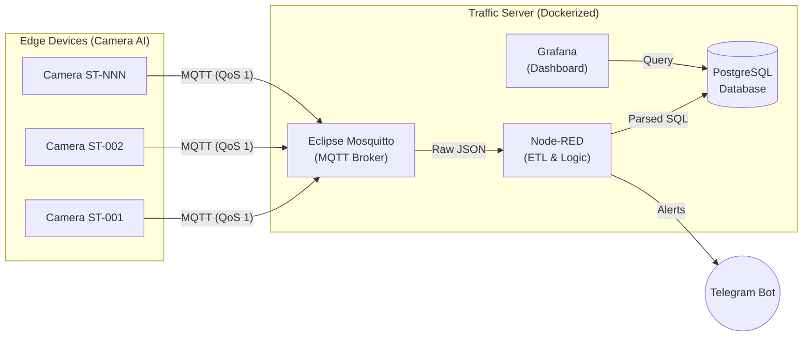

<div align="center">
  <h1>🚦 SHTP Traffic Server (AI Camera Dashboard)</h1>
  <p><i>An industrial-grade IoT backend for smart traffic monitoring at Saigon Hi-Tech Park (SHTP).</i></p>
  
  [](https://www.docker.com/)
  [](https://mqtt.org/)
  [](https://nodered.org/)
  [](https://www.postgresql.org/)
  [](https://grafana.com/)
</div>

---

## 📖 Overview

The **SHTP Traffic Server** is a production-ready, containerized Edge-to-Cloud data pipeline designed specifically for AI-driven traffic cameras. It aggregates, parses, stores, and visualizes real-time vehicle telemetry and hardware diagnostics at the edge.

Built to be deployed on resource-constrained devices (like Raspberry Pi 4/5) or cloud servers, it features a highly resilient architecture that handles intermittent network connections seamlessly.

## 🏗️ Architecture



## ✨ Key Features

- **🚀 High-Throughput Ingestion**: Powered by Eclipse Mosquitto to handle hundreds of edge devices simultaneously.
- **⚙️ Automated ETL Workflow**: Node-RED visually processes raw JSON payloads, deduplicates QoS-1 messages, and inserts formatted data into the database.
- **📊 Real-time Visualization**: Pre-configured Grafana dashboards for both Traffic Analytics (Motorbikes, Cars, Trucks) and Hardware Health (CPU Temp, Network RSSI).
- **🛡️ Secure by Default**: Encrypted credentials, password-protected MQTT broker, and hidden environment variables.
- **🚨 Instant Alerts**: Integration with Telegram Bot to notify administrators of critical hardware failures (e.g., enclosure overheating).

## 📂 Project Structure

```text
.
├── docker-compose.yml       # Docker orchestration configuration
├── run.sh                   # Interactive setup + launch script (camera config, Docker stack, edge/AI/bot processes)
├── .env.example             # Environment variables template
├── edge-rpi/                # Camera capture & RTSP streaming (runs on the Raspberry Pi)
├── ai-worker/                # YOLO-based vehicle detection + MQTT telemetry publisher
├── tg_bot/                  # Telegram bot for remote monitoring/control (runs on the host, not in Docker)
├── mosquitto/               # MQTT broker configurations & ACLs
├── nodered/                 # Node-RED flows, settings, and plugins
├── postgres/                # PostgreSQL init scripts (Seed data & Schema)
├── grafana/                 # Grafana provisioning & dashboard templates
├── systemd/                 # Optional systemd unit to auto-start the stack on boot
├── scripts/                 # Setup helper scripts (e.g. interactive camera source wizard)
└── docs/archive/            # Superseded planning docs, kept for history
```

## 🚀 Quick Start

### 1. Prerequisites
Install these on the host machine (all packages below are Debian/Ubuntu/Raspberry Pi OS names; use your distro's equivalent otherwise):
```bash
sudo apt-get update
sudo apt-get install -y docker.io docker-compose-plugin python3-venv python3-pip ffmpeg libpq-dev git
sudo usermod -aG docker "$USER"   # log out/in (or reboot) for this to take effect
```
- **Docker & Docker Compose** — runs Mosquitto, Postgres, Node-RED, Grafana, MediaMTX.
- **ffmpeg** — used by `edge-rpi/start_stream.sh` to push the camera feed to MediaMTX over RTSP.
- **libpq-dev** — needed to build `psycopg2` from source when setting up `tg_bot/.venv` (no prebuilt wheel exists for every platform/Python combo).
- **python3-venv** — used to create `ai-worker/.venv` and `tg_bot/.venv`.

### 2. Configuration
Copy the environment template and configure your secure passwords:
```bash
cp .env.example .env
# Edit .env with your desired credentials and Telegram Bot Token
```

### 3. Model Setup (required — not included in the repo)
`ai-worker` is not tied to any one model file — `model.path` in `ai-worker/config.yaml` is passed straight into `ultralytics.YOLO(path)`, so any format Ultralytics can load works. Two options:

- **Already have a `.pt` file** (downloaded or trained separately, e.g. `yolov8n.pt`/`yolov8s.pt`)? Plug and play: just set `model.path` to that file's full path — no export step needed. Simplest option, but slower on weak CPUs (e.g. Raspberry Pi).
- **Want better speed on a Raspberry Pi (recommended)**: export once to NCNN format:
  ```bash
  cd ai-worker
  python3 -m venv .venv
  .venv/bin/pip install -r requirements.txt
  .venv/bin/yolo export model=yolov8n.pt format=ncnn imgsz=512
  cd ..
  ```
  This downloads `yolov8n.pt` (~6 MB) and produces `ai-worker/yolov8n_ncnn_model/`.

Either way, this is a binary model file/directory, so it is intentionally **not** committed to the repo — generate or supply your own, then edit `ai-worker/config.yaml` (created from the `.example` on first `./run.sh` run) and set `model.path` to the full path, e.g. `/home/youruser/ai-camera-dashboard/ai-worker/yolov8n_ncnn_model`. Other Ultralytics-supported formats (`.onnx`, `.torchscript`, `.engine`, `.tflite`, ...) should also work the same way, though only `.pt` and NCNN have been exercised on this repo. If you use a custom-trained model with a different class set, also update `model.classes` (default `[1, 2, 3, 5, 7]` assumes COCO class IDs for bicycle/car/motorcycle/bus/truck).

If you have a Hailo-8L NPU available, you can instead set `model.backend: hailo` — see the setup notes already in `ai-worker/config.yaml.example` for that path (this needs a `.hef` file specifically compiled for Hailo-8L, not a plain Ultralytics export).

### 4. tg_bot Setup (optional — Telegram remote control)
`tg_bot/` runs directly on the host (not in Docker), since some of its commands need to control the host/Docker from outside a container:
```bash
cd tg_bot
python3 -m venv .venv
.venv/bin/pip install -r requirements.txt
cd ..
```
Make sure `.env` has `TELEGRAM_BOT_TOKEN`, `TELEGRAM_CHAT_ID`, and (once you know your Telegram numeric user ID) `TELEGRAM_ALLOWED_USER_IDS` filled in. Without a `tg_bot/.venv`, `run.sh` simply skips starting the bot and prints a reminder — the rest of the stack is unaffected.

### 5. Deployment
Run the interactive setup/launch script. It creates missing config files from the `.example` templates, sets up directory permissions, asks for the camera source, starts the Docker stack, and launches `edge_agent.py`, `main.py`, and `tg_bot` (if its venv exists).
```bash
chmod +x run.sh
./run.sh
```

### 6. Access the Services
Once running, the services are available locally:
- **Grafana Dashboard**: [http://localhost:3000](http://localhost:3000)
- **Node-RED Editor**: [http://localhost:1880](http://localhost:1880)

### 7. Optional: Auto-start on boot (systemd)
`systemd/shtp-traffic-server.service` is a template — it has `__RUN_AS_USER__`/`__REPO_DIR__` placeholders instead of a hardcoded user/path, since those are specific to each machine. Install it with:
```bash
sed -e "s#__REPO_DIR__#$(pwd)#g" -e "s#__RUN_AS_USER__#$(whoami)#g" \
  systemd/shtp-traffic-server.service | sudo tee \
  /etc/systemd/system/shtp-traffic-server.service >/dev/null
sudo systemctl daemon-reload
sudo systemctl enable --now shtp-traffic-server.service
```
Check status with `systemctl status shtp-traffic-server.service`, logs at `run_boot.log` in the repo root.

## 📜 License

This project is licensed under the MIT License - see the LICENSE file for details. Developed for the Saigon Hi-Tech Park (SHTP) Smart Traffic initiative.
