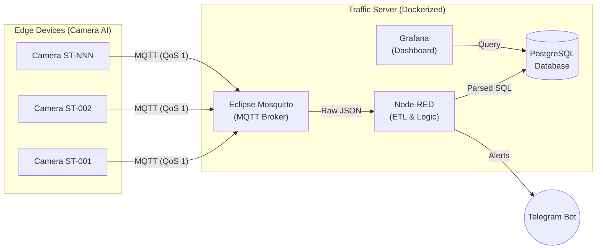

<div align="center">
  <h1>🚦 SHTP Traffic Server (AI Camera Dashboard)</h1>
  <p><i>An industrial-grade IoT backend for smart traffic monitoring at Saigon Hi-Tech Park (SHTP).</i></p>
  
  [](https://www.docker.com/)
  [](https://mqtt.org/)
  [](https://nodered.org/)
  [](https://www.postgresql.org/)
  [](https://grafana.com/)
</div>

---

## 📖 Overview

The **SHTP Traffic Server** is a production-ready, containerized Edge-to-Cloud data pipeline designed specifically for AI-driven traffic cameras. It aggregates, parses, stores, and visualizes real-time vehicle telemetry and hardware diagnostics at the edge.

Built to be deployed on resource-constrained devices (like Raspberry Pi 4/5) or cloud servers, it features a highly resilient architecture that handles intermittent network connections seamlessly.

## 🏗️ Architecture



## ✨ Key Features

- **🚀 High-Throughput Ingestion**: Powered by Eclipse Mosquitto to handle hundreds of edge devices simultaneously.
- **⚙️ Automated ETL Workflow**: Node-RED visually processes raw JSON payloads, deduplicates QoS-1 messages, and inserts formatted data into the database.
- **📊 Real-time Visualization**: Pre-configured Grafana dashboards for both Traffic Analytics (Motorbikes, Cars, Trucks) and Hardware Health (CPU Temp, Network RSSI).
- **🛡️ Secure by Default**: Encrypted credentials, password-protected MQTT broker, and hidden environment variables.
- **🚨 Instant Alerts**: Integration with Telegram Bot to notify administrators of critical hardware failures (e.g., enclosure overheating).

## 📂 Project Structure

```text
.
├── docker-compose.yml       # Docker orchestration configuration
├── run.sh                   # Interactive setup + launch script (camera config, Docker stack, edge/AI processes)
├── .env.example             # Environment variables template
├── edge-rpi/                # Camera capture & RTSP streaming (runs on the Raspberry Pi)
├── ai-worker/                # YOLO-based vehicle detection/tracking + MQTT telemetry publisher
├── mosquitto/               # MQTT broker configurations & ACLs
├── nodered/                 # Node-RED flows, settings, and plugins
├── postgres/                # PostgreSQL init scripts (Seed data & Schema)
├── grafana/                 # Grafana provisioning & dashboard templates
└── docs/archive/            # Superseded planning docs, kept for history
```

## 🚀 Quick Start

### 1. Prerequisites
- Docker & Docker Compose installed.
- Python 3.8+ with the `ai-worker/.venv` set up (see `ai-worker/requirements.txt`).

### 2. Configuration
Copy the environment template and configure your secure passwords:
```bash
cp .env.example .env
# Edit .env with your desired credentials and Telegram Bot Token
```

### 3. Deployment
Run the interactive setup/launch script. It creates missing config files from the `.example` templates, sets up directory permissions, asks for the camera source, starts the Docker stack, and launches `edge_agent.py` + `main.py`.
```bash
chmod +x run.sh
./run.sh
```

### 4. Access the Services
Once running, the services are available locally:
- **Grafana Dashboard**: [http://localhost:3000](http://localhost:3000)
- **Node-RED Editor**: [http://localhost:1880](http://localhost:1880)

## 📜 License

This project is licensed under the MIT License - see the LICENSE file for details. Developed for the Saigon Hi-Tech Park (SHTP) Smart Traffic initiative.
