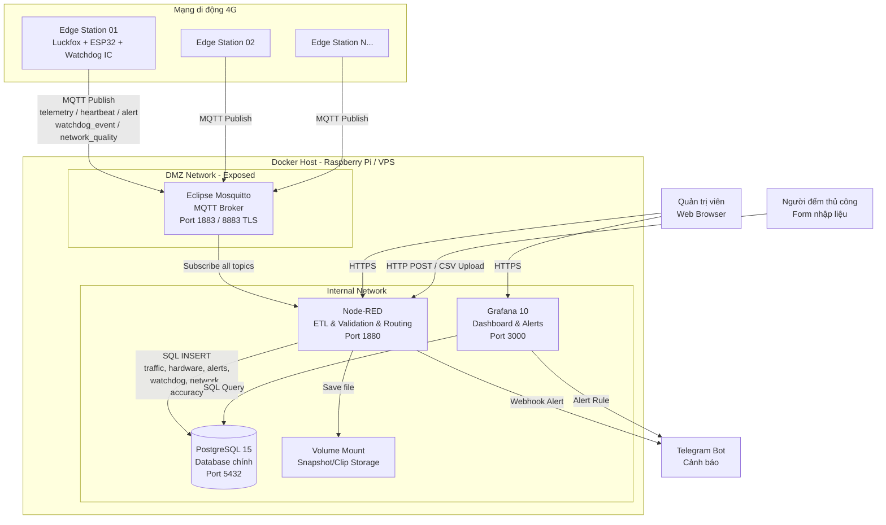
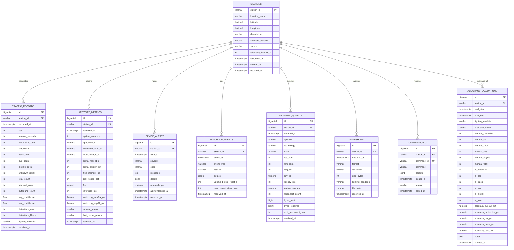
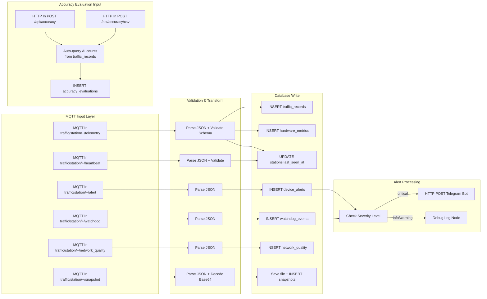
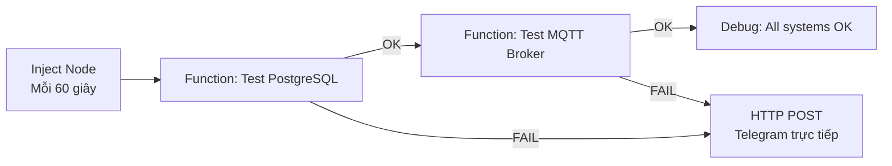

# Server Plan — Tổ Server (Hạ tầng & Vận hành)

> **Dự án**: Hệ thống Camera AI phân loại giao thông  
> **Tổ phụ trách**: Tổ 3 — Server (Hạ tầng & Vận hành)  
> **Số thành viên**: 3  
> **Nền tảng Server**: Raspberry Pi 4/5 (ARM64) hoặc VPS x86_64  
> **Phiên bản tài liệu**: 3.2 — 17/06/2026  
> **Cập nhật**: Thêm MQTT LWT, Capacity Planning, Server Self-Monitoring, Deployment Guide, Node-RED plugins, fix .env 2 users

---

## Mục lục

1. [Tổng quan & Phạm vi trách nhiệm](#1-tổng-quan--phạm-vi-trách-nhiệm)
2. [Kiến trúc Hệ thống Chi tiết](#2-kiến-trúc-hệ-thống-chi-tiết)
3. [Giao ước Dữ liệu (Data Contract)](#3-giao-ước-dữ-liệu-data-contract)
4. [Thiết kế Cơ sở Dữ liệu](#4-thiết-kế-cơ-sở-dữ-liệu)
5. [Cấu hình Docker Compose](#5-cấu-hình-docker-compose)
6. [Luồng xử lý dữ liệu Node-RED](#6-luồng-xử-lý-dữ-liệu-node-red)
7. [Thiết kế Dashboard Grafana](#7-thiết-kế-dashboard-grafana)
8. [Hệ thống Cảnh báo (Alerting)](#8-hệ-thống-cảnh-báo-alerting)
9. [Bảo mật & Xác thực](#9-bảo-mật--xác-thực)
10. [Logging, Monitoring & Backup](#10-logging-monitoring--backup)
11. [Giả lập Trạm Biên (Edge Simulator)](#11-giả-lập-trạm-biên-edge-simulator)
12. [Quy trình Ghép nối & Tích hợp (Integration)](#12-quy-trình-ghép-nối--tích-hợp-integration)
13. [Đánh giá Độ chính xác AI (Accuracy Evaluation)](#13-đánh-giá-độ-chính-xác-ai-accuracy-evaluation)
14. [Quy trình Thử nghiệm Hiện trường (Field Test)](#14-quy-trình-thử-nghiệm-hiện-trường-field-test)
15. [Capacity Planning (Ước tính Tài nguyên)](#15-capacity-planning-ước-tính-tài-nguyên)
16. [Server Self-Monitoring (Giám sát chính Server)](#16-server-self-monitoring-giám-sát-chính-server)
17. [Deployment Guide (Hướng dẫn Triển khai)](#17-deployment-guide-hướng-dẫn-triển-khai)
18. [Lộ trình Phát triển theo Tuần](#18-lộ-trình-phát-triển-theo-tuần)
19. [Phân công Nội bộ Tổ Server (3 người)](#19-phân-công-nội-bộ-tổ-server-3-người)
20. [Rủi ro & Phương án Dự phòng](#20-rủi-ro--phương-án-dự-phòng)
21. [Cấu trúc Thư mục Dự án](#21-cấu-trúc-thư-mục-dự-án)

---

## 1. Tổng quan & Phạm vi trách nhiệm

### 1.1. Mục tiêu

Xây dựng **hạ tầng server hoàn chỉnh** có khả năng:
- Tiếp nhận dữ liệu giao thông thời gian thực từ nhiều trạm biên (Edge Station) qua giao thức MQTT trên mạng di động 4G.
- Xử lý, kiểm tra tính hợp lệ, chuyển đổi và lưu trữ dữ liệu vào cơ sở dữ liệu quan hệ.
- Trực quan hóa dữ liệu qua Dashboard chuyên nghiệp (Grafana).
- Cảnh báo tự động khi phát hiện sự cố phần cứng hoặc bất thường lưu lượng giao thông.
- **Đánh giá độ chính xác nhận diện AI** (ban ngày vs ban đêm) thông qua so sánh với dữ liệu đếm thủ công.
- **Theo dõi sự kiện Watchdog** (ESP32 ↔ Luckfox chéo, IC cứng reset) để đánh giá độ ổn định 24/7.
- **Giám sát chất lượng đường truyền 4G** (packet loss, latency, reconnect count).
- **Lưu trữ snapshot/video clip** từ camera khi được yêu cầu (tương lai).
- Sẵn sàng ghép nối (plug-and-play) với thiết bị thật của Tổ Edge mà không cần chỉnh sửa code phía Server.

### 1.2. Phạm vi trách nhiệm của Tổ Server

| Thuộc phạm vi (In-scope) | Ngoài phạm vi (Out-of-scope) |
| :--- | :--- |
| MQTT Broker setup & bảo mật | Thiết kế mạch PCB phần cứng |
| Node-RED ETL pipeline | Lập trình nhúng trên Luckfox / ESP32 |
| Database schema & migration | Huấn luyện mô hình YOLO |
| Grafana Dashboard (lưu lượng + phần cứng + accuracy) | Chuyển đổi mô hình sang RKNN |
| Alerting & Notification (Telegram) | Thiết kế vỏ hộp kháng nước |
| Edge Simulator (mock data) | Triển khai thực địa ngoài trời |
| Docker Compose orchestration | Mạch nguồn / Watchdog IC |
| Logging & Backup | Giao tiếp AT command 4G |
| Tài liệu API Contract giao cho Tổ Edge | — |
| Accuracy Evaluation pipeline & tools | — |
| Field Test protocol & checklist | — |
| Watchdog event tracking & statistics | — |
| Network quality monitoring (4G metrics) | — |
| Media storage (snapshot/clip từ Edge) | — |

### 1.3. Nguyên tắc Phát triển Song song

```
Tổ Edge & Tổ Server thống nhất DATA CONTRACT (Mục 3)
          ↓
┌─────────────────────┐     ┌─────────────────────┐
│     Tổ Edge         │     │     Tổ Server       │
│ - Thiết kế phần cứng│     │ - Dựng Docker       │
│ - Nhúng YOLO        │     │ - Node-RED pipeline  │
│ - ESP32 → MQTT      │     │ - Database schema    │
│ - Watchdog chéo     │     │ - Grafana Dashboard   │
│                     │     │ - Accuracy eval tools  │
│  Dùng MQTT client   │     │  Dùng edge_simulator │
│  test gửi lên Server│     │  để giả lập dữ liệu  │
└─────────┬───────────┘     └──────────┬──────────┘
          │        GHÉP NỐI            │
          └────────────────────────────┘
          Chỉ cần đổi MQTT Broker IP
```

---

## 2. Kiến trúc Hệ thống Chi tiết

### 2.1. Sơ đồ Kiến trúc Tổng thể



### 2.2. Bảng Dịch vụ & Port Mapping

| Dịch vụ | Docker Image | Port Nội bộ | Port Expose | Mục đích |
| :--- | :--- | :--- | :--- | :--- |
| MQTT Broker | `eclipse-mosquitto:2.0` | 1883 | **1883** (MQTT) / **8883** (MQTTS) | Nhận & phân phối message |
| Node-RED | `nodered/node-red:3.1` | 1880 | **1880** | ETL pipeline, validation, routing, accuracy input |
| PostgreSQL | `postgres:15-alpine` | 5432 | **5432** (chỉ internal) | Lưu trữ dữ liệu chính |
| Grafana | `grafana/grafana:10.4.0` | 3000 | **3000** | Dashboard trực quan & alerting |

> **Lưu ý ARM64 (Raspberry Pi)**: Tất cả Docker image trên đều hỗ trợ kiến trúc `linux/arm64`. Khi chạy trên RPi 4 (4GB RAM), cần giới hạn `mem_limit` cho mỗi container để tránh OOM. Khuyến nghị: Mosquitto 128MB, Node-RED 512MB, PostgreSQL 1GB, Grafana 512MB.

### 2.3. Docker Network & Volume Topology

```
docker-network: shtp-net (bridge)
├── mosquitto    → 1883:1883, 8883:8883
├── nodered      → 1880:1880
├── postgres     → 5432 (internal only)
└── grafana      → 3000:3000

docker-volumes:
├── mosquitto-data      → /mosquitto/data
├── mosquitto-log       → /mosquitto/log
├── nodered-data        → /data (Node-RED flows, credentials)
├── postgres-data       → /var/lib/postgresql/data
├── grafana-data        → /var/lib/grafana
└── media-storage       → /media (snapshots, video clips)
```

---

## 3. Giao ước Dữ liệu (Data Contract)

> **Đây là tài liệu giao ước chính thức giữa Tổ Server và Tổ Edge.**  
> Mọi thay đổi phải được cả hai tổ đồng ý trước khi cập nhật.  
> Nhật ký thay đổi ghi vào `CONTRACT_CHANGELOG.md`.

### 3.1. Giao thức Truyền thông

| Thông số | Giá trị |
| :--- | :--- |
| Protocol | MQTT v3.1.1 |
| Transport | TCP (dev) / TLS 1.2+ (production) |
| QoS | **QoS 1** (At least once delivery) |
| Keep Alive | 60 giây |
| Clean Session | `false` (cho phép nhận tin nhắn offline khi reconnect) |
| Retry Interval | Mỗi 30 giây nếu mất kết nối |
| Max Payload Size | 256 KB (đủ cho JSON + base64 snapshot nhỏ) |
| Encoding | UTF-8 |
| **Last Will & Testament** | Khi trạm biên ngắt kết nối đột ngột, MQTT Broker tự động publish tin nhắn LWT |
| LWT Topic | `traffic/station/<station_id>/heartbeat` |
| LWT Payload | `{ "station_id": "<id>", "timestamp": 0, "status": "offline_unexpected" }` |
| LWT QoS | 1 |
| LWT Retain | `true` (để trạm khác hoặc dashboard biết ngay khi subscribe) |

> **MQTT LWT (Last Will & Testament)** là cơ chế tiêu chuẩn để phát hiện thiết bị mất kết nối đột ngột (ví dụ: mất nguồn, mất mạng). Khi client kết nối tới Broker, nó đăng ký sẵn một "di chúc" (LWT message). Nếu client bị ngắt không graceful (không gửi DISCONNECT), Broker sẽ tự động publish message đó. Server sử dụng LWT kết hợp với heartbeat timeout 90 giây để phát hiện trạm offline nhanh nhất có thể.

### 3.2. MQTT Topic Hierarchy

```
traffic/
├── station/
│   ├── <station_id>/
│   │   ├── telemetry         ← Dữ liệu đếm xe + hardware status (Edge → Server)
│   │   ├── heartbeat         ← Tín hiệu sống (Edge → Server), mỗi 30s
│   │   ├── alert             ← Cảnh báo từ thiết bị (Edge → Server)
│   │   ├── watchdog          ← Sự kiện Watchdog reset (Edge → Server)
│   │   ├── network_quality   ← Chất lượng đường truyền 4G (Edge → Server)
│   │   ├── snapshot          ← Ảnh chụp từ camera (Edge → Server, base64)
│   │   ├── command           ← Lệnh điều khiển (Server → Edge)
│   │   └── config            ← Cấu hình từ xa (Server → Edge)
│   └── broadcast/
│       └── command           ← Lệnh gửi tới TẤT CẢ trạm (Server → Edge)
└── server/
    └── status                ← Server thông báo trạng thái (Server → All)
```

### 3.3. Payload Schema — Telemetry (Dữ liệu chính)

**Topic**: `traffic/station/<station_id>/telemetry`  
**Direction**: Edge → Server  
**Tần suất gửi**: Mỗi **60 giây** (có thể điều chỉnh từ xa qua topic `config`)

```json
{
  "v": 1,
  "station_id": "ST-001",
  "timestamp": 1718600000,
  "seq": 42,
  "interval_seconds": 60,
  "data": {
    "vehicles": {
      "motorbike": 14,
      "car": 4,
      "truck": 1,
      "bus": 0,
      "bicycle": 2,
      "unknown": 1
    },
    "total": 22,
    "direction": {
      "inbound": 13,
      "outbound": 9
    },
    "avg_confidence": 0.87,
    "min_confidence": 0.52,
    "detections_raw": 25,
    "detections_filtered": 22,
    "lighting_condition": "day"
  },
  "status": {
    "cpu_temp_c": 45.2,
    "enclosure_temp_c": 38.7,
    "input_voltage_v": 12.05,
    "signal_rssi_dbm": -72,
    "signal_quality_percent": 68,
    "free_memory_kb": 124500,
    "disk_usage_percent": 23,
    "uptime_seconds": 86400,
    "fps": 15.2,
    "inference_ms": 42,
    "watchdog_luckfox_ok": true,
    "watchdog_esp32_ok": true,
    "camera_status": "connected",
    "last_reboot_reason": "normal"
  }
}
```

#### Chi tiết các trường (Field Reference)

**Nhóm Root**:

| Trường | Kiểu | Bắt buộc | Mô tả | Phạm vi hợp lệ |
| :--- | :--- | :--- | :--- | :--- |
| `v` | int | ✅ | Phiên bản schema payload | `1` |
| `station_id` | string | ✅ | Mã định danh trạm, theo quy ước `ST-XXX` | `^ST-\d{3}$` |
| `timestamp` | int | ✅ | Unix epoch (giây) lúc đo đạc | > 1700000000 |
| `seq` | int | ✅ | Số thứ tự gói tin (tăng dần, reset khi reboot) | ≥ 0 |
| `interval_seconds` | int | ✅ | Chu kỳ đo (giây) | 10–300 |

**Nhóm `data` (Dữ liệu đếm xe)**:

| Trường | Kiểu | Bắt buộc | Mô tả | Phạm vi hợp lệ |
| :--- | :--- | :--- | :--- | :--- |
| `data.vehicles.motorbike` | int | ✅ | Số xe máy | ≥ 0 |
| `data.vehicles.car` | int | ✅ | Số ô tô con | ≥ 0 |
| `data.vehicles.truck` | int | ✅ | Số xe tải | ≥ 0 |
| `data.vehicles.bus` | int | ✅ | Số xe buýt | ≥ 0 |
| `data.vehicles.bicycle` | int | ✅ | Số xe đạp | ≥ 0 |
| `data.vehicles.unknown` | int | ✅ | Phương tiện không xác định loại | ≥ 0 |
| `data.total` | int | ✅ | Tổng tất cả phương tiện | ≥ 0 |
| `data.direction.inbound` | int | ❌ | Xe đi vào hướng đếm | ≥ 0 |
| `data.direction.outbound` | int | ❌ | Xe đi ra hướng đếm | ≥ 0 |
| `data.avg_confidence` | float | ❌ | Độ tin cậy trung bình YOLO | 0.0–1.0 |
| `data.min_confidence` | float | ❌ | Độ tin cậy thấp nhất trong chu kỳ | 0.0–1.0 |
| `data.detections_raw` | int | ❌ | Tổng detections trước lọc (pre-NMS) | ≥ 0 |
| `data.detections_filtered` | int | ❌ | Detections sau lọc (post-NMS, final) | ≥ 0 |
| `data.lighting_condition` | string | ❌ | Điều kiện ánh sáng tự động phát hiện | `day`, `night`, `dawn`, `dusk` |

**Nhóm `status` (Trạng thái phần cứng)**:

| Trường | Kiểu | Bắt buộc | Mô tả | Phạm vi hợp lệ |
| :--- | :--- | :--- | :--- | :--- |
| `status.cpu_temp_c` | float | ✅ | Nhiệt độ CPU Luckfox (°C) | 0–100 |
| `status.enclosure_temp_c` | float | ❌ | Nhiệt độ bên trong hộp kín (°C) — sensor DHT22/DS18B20 | 0–85 |
| `status.input_voltage_v` | float | ✅ | Điện áp nguồn cấp (V) | 0–30 |
| `status.signal_rssi_dbm` | int | ✅ | Cường độ sóng 4G (dBm) | -120 – 0 |
| `status.signal_quality_percent` | int | ❌ | Chất lượng sóng tổng hợp (%) | 0–100 |
| `status.free_memory_kb` | int | ✅ | RAM trống Luckfox (KB) | ≥ 0 |
| `status.disk_usage_percent` | int | ❌ | Phần trăm ổ đĩa đã dùng | 0–100 |
| `status.uptime_seconds` | int | ✅ | Thời gian hoạt động liên tục (giây) | ≥ 0 |
| `status.fps` | float | ❌ | Tốc độ xử lý khung hình thực tế | > 0 |
| `status.inference_ms` | int | ❌ | Thời gian suy luận YOLO mỗi frame (ms) | > 0 |
| `status.watchdog_luckfox_ok` | bool | ❌ | ESP32 xác nhận nhận được heartbeat từ Luckfox | `true`/`false` |
| `status.watchdog_esp32_ok` | bool | ❌ | Luckfox xác nhận nhận được heartbeat từ ESP32 | `true`/`false` |
| `status.camera_status` | string | ❌ | Trạng thái camera | `connected`, `disconnected`, `error` |
| `status.last_reboot_reason` | string | ❌ | Lý do reboot gần nhất | `normal`, `watchdog_hw`, `watchdog_sw`, `power_loss`, `ota`, `manual` |

### 3.4. Payload Schema — Heartbeat

**Topic**: `traffic/station/<station_id>/heartbeat`  
**Direction**: Edge → Server  
**Tần suất**: Mỗi **30 giây**

```json
{
  "station_id": "ST-001",
  "timestamp": 1718600030,
  "uptime_seconds": 86430,
  "status": "running",
  "watchdog": {
    "luckfox_heartbeat_ok": true,
    "esp32_heartbeat_ok": true,
    "hw_watchdog_fed": true,
    "total_resets_luckfox": 0,
    "total_resets_esp32": 0,
    "total_resets_hw_watchdog": 0
  }
}
```

| Trường | Kiểu | Mô tả |
| :--- | :--- | :--- |
| `status` | string | `running`, `degraded`, `error`, `rebooting` |
| `watchdog.luckfox_heartbeat_ok` | bool | ESP32 đang nhận được heartbeat từ Luckfox |
| `watchdog.esp32_heartbeat_ok` | bool | Luckfox đang nhận được heartbeat từ ESP32 |
| `watchdog.hw_watchdog_fed` | bool | IC watchdog cứng đang được feed đúng hạn |
| `watchdog.total_resets_luckfox` | int | Tổng số lần ESP32 đã reset Luckfox (kể từ lần boot gần nhất của ESP32) |
| `watchdog.total_resets_esp32` | int | Tổng số lần Luckfox đã reset ESP32 |
| `watchdog.total_resets_hw_watchdog` | int | Tổng số lần IC watchdog cứng đã kích hoạt reset |

> **Quy tắc phía Server**: Nếu không nhận được heartbeat từ một trạm trong vòng **90 giây** (3 lần miss), Server sẽ đánh dấu trạm đó là `offline` và gửi cảnh báo Telegram.

### 3.5. Payload Schema — Watchdog Event

**Topic**: `traffic/station/<station_id>/watchdog`  
**Direction**: Edge → Server  
**Tần suất**: Chỉ khi xảy ra sự kiện reset

```json
{
  "station_id": "ST-001",
  "timestamp": 1718600500,
  "event": "luckfox_reset_by_esp32",
  "reason": "heartbeat_timeout",
  "details": {
    "last_heartbeat_age_ms": 15200,
    "threshold_ms": 10000,
    "uptime_before_reset_s": 43200,
    "reset_count_since_boot": 2
  }
}
```

| Event Type | Mô tả |
| :--- | :--- |
| `luckfox_reset_by_esp32` | ESP32 phát hiện Luckfox không phản hồi heartbeat → kích hoạt reset Luckfox |
| `esp32_reset_by_luckfox` | Luckfox phát hiện ESP32 không phản hồi → kích hoạt reset ESP32 |
| `hw_watchdog_triggered` | IC cứng watchdog không được feed → kích hoạt reset toàn bộ mạch |
| `power_cycle_detected` | Phát hiện mất nguồn rồi có nguồn lại |
| `manual_reset` | Nút nhấn reset vật lý hoặc lệnh remote reboot |

### 3.6. Payload Schema — Network Quality

**Topic**: `traffic/station/<station_id>/network_quality`  
**Direction**: Edge → Server  
**Tần suất**: Mỗi **5 phút**

```json
{
  "station_id": "ST-001",
  "timestamp": 1718600300,
  "network": {
    "operator": "Viettel",
    "technology": "4G-LTE",
    "band": "B3",
    "rssi_dbm": -72,
    "rsrp_dbm": -95,
    "rsrq_db": -11,
    "sinr_db": 8.5,
    "latency_ms": 85,
    "packet_loss_percent": 0.5,
    "reconnect_count": 0,
    "bytes_sent_total": 1048576,
    "bytes_received_total": 524288,
    "mqtt_reconnect_count": 0
  }
}
```

| Trường | Kiểu | Mô tả | Ngưỡng tốt |
| :--- | :--- | :--- | :--- |
| `rssi_dbm` | int | Cường độ tín hiệu nhận | > -70 |
| `rsrp_dbm` | int | Reference Signal Received Power | > -90 |
| `rsrq_db` | int | Reference Signal Received Quality | > -10 |
| `sinr_db` | float | Signal-to-Interference+Noise Ratio | > 10 |
| `latency_ms` | int | RTT ping tới MQTT Broker | < 200 |
| `packet_loss_percent` | float | Tỷ lệ mất gói (%) | < 2% |
| `reconnect_count` | int | Số lần kết nối lại mạng di động trong kỳ | 0 |
| `mqtt_reconnect_count` | int | Số lần reconnect MQTT trong kỳ | 0 |

### 3.7. Payload Schema — Alert (Cảnh báo từ thiết bị)

**Topic**: `traffic/station/<station_id>/alert`  
**Direction**: Edge → Server  

```json
{
  "station_id": "ST-001",
  "timestamp": 1718600100,
  "severity": "critical",
  "code": "OVERHEAT",
  "message": "CPU temperature exceeded 75°C threshold",
  "details": {
    "cpu_temp_c": 78.3,
    "enclosure_temp_c": 62.1,
    "ambient_note": "direct sunlight"
  }
}
```

| Severity | Mô tả | Hành động Server |
| :--- | :--- | :--- |
| `info` | Thông tin chung (reboot xong, cập nhật firmware) | Ghi log |
| `warning` | Cảnh báo nhẹ (sóng yếu, RAM thấp) | Ghi log + hiển thị trên dashboard |
| `critical` | Sự cố nghiêm trọng (quá nhiệt, mất camera) | Ghi log + dashboard + **gửi Telegram** |

| Alert Code | Mô tả | Nguồn phát hiện |
| :--- | :--- | :--- |
| `OVERHEAT_CPU` | Nhiệt độ CPU Luckfox vượt ngưỡng 75°C | Luckfox sensor |
| `OVERHEAT_ENCLOSURE` | Nhiệt độ hộp kín vượt ngưỡng 60°C | DHT22/DS18B20 |
| `LOW_VOLTAGE` | Điện áp đầu vào dưới 10.5V | ESP32 ADC |
| `CAMERA_LOST` | Mất kết nối camera MIPI CSI/RTSP | Luckfox driver |
| `MEMORY_LOW` | RAM trống dưới 50MB | Luckfox OS |
| `DISK_FULL` | Ổ đĩa sử dụng trên 90% | Luckfox OS |
| `WATCHDOG_RESET` | Watchdog IC cứng hoặc SW đã kích hoạt reset | ESP32/Luckfox |
| `4G_RECONNECT` | Module 4G mất sóng và đang kết nối lại | ESP32 AT cmd |
| `FPS_LOW` | FPS xử lý AI xuống dưới 5 FPS | Luckfox RKNN |
| `INFERENCE_SLOW` | Inference time vượt 200ms/frame | Luckfox RKNN |

### 3.8. Payload Schema — Snapshot (Ảnh chụp)

**Topic**: `traffic/station/<station_id>/snapshot`  
**Direction**: Edge → Server  
**Tần suất**: Khi được yêu cầu qua command `capture_snapshot`, hoặc tự động mỗi 15 phút (tuỳ cấu hình)

```json
{
  "station_id": "ST-001",
  "timestamp": 1718600600,
  "format": "jpeg",
  "resolution": "640x480",
  "size_bytes": 45000,
  "lighting_condition": "day",
  "image_base64": "/9j/4AAQSkZJRgABAQ..."
}
```

> **Lưu ý**: Snapshot được Node-RED decode từ base64, lưu vào thư mục `media-storage` volume, và ghi metadata vào bảng `snapshots`.

### 3.9. Payload Schema — Command (Lệnh từ Server)

**Topic**: `traffic/station/<station_id>/command`  
**Direction**: Server → Edge  

```json
{
  "command": "set_interval",
  "params": {
    "interval_seconds": 30
  },
  "issued_at": 1718600200,
  "command_id": "cmd-2026-0617-001"
}
```

| Command | Params | Mô tả |
| :--- | :--- | :--- |
| `set_interval` | `{ "interval_seconds": <int> }` | Thay đổi chu kỳ gửi telemetry |
| `reboot` | `{ "target": "luckfox" \| "esp32" \| "all" }` | Yêu cầu trạm biên reboot (chọn target) |
| `capture_snapshot` | `{ "resolution": "640x480" }` | Chụp 1 frame và gửi về |
| `set_confidence_threshold` | `{ "threshold": 0.5 }` | Thay đổi ngưỡng confidence YOLO |
| `enable_night_mode` | `{ "enabled": true, "ir_led": true }` | Bật/tắt chế độ ban đêm |
| `update_firmware` | `{ "url": "<url>", "checksum": "<md5>" }` | OTA firmware update (tương lai) |
| `ping` | `{}` | Yêu cầu trạm phản hồi (kiểm tra kết nối) |

### 3.10. Payload Schema — Config (Cấu hình từ xa)

**Topic**: `traffic/station/<station_id>/config`  
**Direction**: Server → Edge  
**Retained**: `true` (trạm sẽ nhận config ngay khi kết nối lại)

```json
{
  "config_version": 3,
  "updated_at": 1718601000,
  "telemetry_interval_s": 60,
  "heartbeat_interval_s": 30,
  "network_quality_interval_s": 300,
  "snapshot_auto_interval_s": 900,
  "yolo_confidence_threshold": 0.5,
  "night_mode_auto": true,
  "watchdog_timeout_ms": 10000
}
```

---

## 4. Thiết kế Cơ sở Dữ liệu

### 4.1. ERD (Entity Relationship Diagram)



### 4.2. SQL DDL Script (`init.sql`)

```sql
-- ============================================================
-- File: init.sql
-- Mô tả: Khởi tạo toàn bộ schema cho hệ thống SHTP Traffic
-- Phiên bản: 3.0
-- ============================================================

CREATE EXTENSION IF NOT EXISTS "uuid-ossp";

-- -----------------------------------------------------------
-- 1. STATIONS
-- -----------------------------------------------------------
CREATE TABLE IF NOT EXISTS stations (
    station_id          VARCHAR(50)   PRIMARY KEY,
    location_name       VARCHAR(255)  NOT NULL,
    latitude            DECIMAL(9,6),
    longitude           DECIMAL(9,6),
    description         TEXT,
    firmware_version    VARCHAR(50),
    status              VARCHAR(20)   NOT NULL DEFAULT 'inactive',
    telemetry_interval_s INT          NOT NULL DEFAULT 60,
    last_seen_at        TIMESTAMPTZ,
    created_at          TIMESTAMPTZ   NOT NULL DEFAULT CURRENT_TIMESTAMP,
    updated_at          TIMESTAMPTZ   NOT NULL DEFAULT CURRENT_TIMESTAMP,
    
    CONSTRAINT chk_status CHECK (status IN ('active','inactive','offline','maintenance'))
);

COMMENT ON TABLE stations IS 'Danh sách các trạm camera AI biên';

-- -----------------------------------------------------------
-- 2. TRAFFIC_RECORDS
-- -----------------------------------------------------------
CREATE TABLE IF NOT EXISTS traffic_records (
    id                  BIGSERIAL     PRIMARY KEY,
    station_id          VARCHAR(50)   NOT NULL REFERENCES stations(station_id) ON DELETE CASCADE,
    recorded_at         TIMESTAMPTZ   NOT NULL,
    seq                 INT,
    interval_seconds    INT           NOT NULL DEFAULT 60,
    motorbike_count     INT           NOT NULL DEFAULT 0 CHECK (motorbike_count >= 0),
    car_count           INT           NOT NULL DEFAULT 0 CHECK (car_count >= 0),
    truck_count         INT           NOT NULL DEFAULT 0 CHECK (truck_count >= 0),
    bus_count           INT           NOT NULL DEFAULT 0 CHECK (bus_count >= 0),
    bicycle_count       INT           NOT NULL DEFAULT 0 CHECK (bicycle_count >= 0),
    unknown_count       INT           NOT NULL DEFAULT 0 CHECK (unknown_count >= 0),
    total_count         INT           NOT NULL DEFAULT 0 CHECK (total_count >= 0),
    inbound_count       INT           DEFAULT 0,
    outbound_count      INT           DEFAULT 0,
    avg_confidence      NUMERIC(4,3)  CHECK (avg_confidence >= 0 AND avg_confidence <= 1),
    min_confidence      NUMERIC(4,3)  CHECK (min_confidence >= 0 AND min_confidence <= 1),
    detections_raw      INT           DEFAULT 0,
    detections_filtered INT           DEFAULT 0,
    lighting_condition  VARCHAR(10),
    received_at         TIMESTAMPTZ   NOT NULL DEFAULT CURRENT_TIMESTAMP
);

CREATE INDEX idx_traffic_station_time ON traffic_records(station_id, recorded_at DESC);
CREATE INDEX idx_traffic_recorded_at  ON traffic_records(recorded_at DESC);
CREATE INDEX idx_traffic_lighting     ON traffic_records(lighting_condition, recorded_at DESC);

-- -----------------------------------------------------------
-- 3. HARDWARE_METRICS
-- -----------------------------------------------------------
CREATE TABLE IF NOT EXISTS hardware_metrics (
    id                      BIGSERIAL   PRIMARY KEY,
    station_id              VARCHAR(50) NOT NULL REFERENCES stations(station_id) ON DELETE CASCADE,
    recorded_at             TIMESTAMPTZ NOT NULL,
    uptime_seconds          INT,
    cpu_temp_c              NUMERIC(5,2),
    enclosure_temp_c        NUMERIC(5,2),
    input_voltage_v         NUMERIC(5,2),
    signal_rssi_dbm         INT,
    signal_quality_pct      INT,
    free_memory_kb          INT,
    disk_usage_pct          INT,
    fps                     NUMERIC(5,2),
    inference_ms            INT,
    watchdog_luckfox_ok     BOOLEAN,
    watchdog_esp32_ok       BOOLEAN,
    camera_status           VARCHAR(20),
    last_reboot_reason      VARCHAR(20),
    received_at             TIMESTAMPTZ NOT NULL DEFAULT CURRENT_TIMESTAMP
);

CREATE INDEX idx_hw_station_time ON hardware_metrics(station_id, recorded_at DESC);

-- -----------------------------------------------------------
-- 4. DEVICE_ALERTS
-- -----------------------------------------------------------
CREATE TABLE IF NOT EXISTS device_alerts (
    id                  BIGSERIAL     PRIMARY KEY,
    station_id          VARCHAR(50)   NOT NULL REFERENCES stations(station_id) ON DELETE CASCADE,
    alert_at            TIMESTAMPTZ   NOT NULL,
    severity            VARCHAR(20)   NOT NULL,
    code                VARCHAR(50)   NOT NULL,
    message             TEXT,
    details             JSONB,
    acknowledged        BOOLEAN       NOT NULL DEFAULT false,
    acknowledged_at     TIMESTAMPTZ,
    received_at         TIMESTAMPTZ   NOT NULL DEFAULT CURRENT_TIMESTAMP,

    CONSTRAINT chk_severity CHECK (severity IN ('info','warning','critical'))
);

CREATE INDEX idx_alerts_station_time    ON device_alerts(station_id, alert_at DESC);
CREATE INDEX idx_alerts_unacknowledged  ON device_alerts(acknowledged) WHERE acknowledged = false;
CREATE INDEX idx_alerts_severity        ON device_alerts(severity, alert_at DESC);

-- -----------------------------------------------------------
-- 5. WATCHDOG_EVENTS
-- -----------------------------------------------------------
CREATE TABLE IF NOT EXISTS watchdog_events (
    id                      BIGSERIAL     PRIMARY KEY,
    station_id              VARCHAR(50)   NOT NULL REFERENCES stations(station_id) ON DELETE CASCADE,
    event_at                TIMESTAMPTZ   NOT NULL,
    event_type              VARCHAR(50)   NOT NULL,
    reason                  VARCHAR(100),
    details                 JSONB,
    uptime_before_reset_s   INT,
    reset_count_since_boot  INT,
    received_at             TIMESTAMPTZ   NOT NULL DEFAULT CURRENT_TIMESTAMP,

    CONSTRAINT chk_event_type CHECK (event_type IN (
        'luckfox_reset_by_esp32',
        'esp32_reset_by_luckfox',
        'hw_watchdog_triggered',
        'power_cycle_detected',
        'manual_reset'
    ))
);

CREATE INDEX idx_watchdog_station_time ON watchdog_events(station_id, event_at DESC);
CREATE INDEX idx_watchdog_event_type   ON watchdog_events(event_type, event_at DESC);

COMMENT ON TABLE watchdog_events IS 'Nhật ký sự kiện Watchdog reset (ESP32↔Luckfox chéo, IC cứng)';

-- -----------------------------------------------------------
-- 6. NETWORK_QUALITY
-- -----------------------------------------------------------
CREATE TABLE IF NOT EXISTS network_quality (
    id                      BIGSERIAL     PRIMARY KEY,
    station_id              VARCHAR(50)   NOT NULL REFERENCES stations(station_id) ON DELETE CASCADE,
    recorded_at             TIMESTAMPTZ   NOT NULL,
    operator                VARCHAR(50),
    technology              VARCHAR(20),
    band                    VARCHAR(10),
    rssi_dbm                INT,
    rsrp_dbm                INT,
    rsrq_db                 INT,
    sinr_db                 NUMERIC(5,2),
    latency_ms              INT,
    packet_loss_pct         NUMERIC(5,2),
    reconnect_count         INT           DEFAULT 0,
    bytes_sent              BIGINT        DEFAULT 0,
    bytes_received          BIGINT        DEFAULT 0,
    mqtt_reconnect_count    INT           DEFAULT 0,
    received_at             TIMESTAMPTZ   NOT NULL DEFAULT CURRENT_TIMESTAMP
);

CREATE INDEX idx_nq_station_time ON network_quality(station_id, recorded_at DESC);

COMMENT ON TABLE network_quality IS 'Chất lượng đường truyền 4G của trạm biên';

-- -----------------------------------------------------------
-- 7. SNAPSHOTS
-- -----------------------------------------------------------
CREATE TABLE IF NOT EXISTS snapshots (
    id                  BIGSERIAL     PRIMARY KEY,
    station_id          VARCHAR(50)   NOT NULL REFERENCES stations(station_id) ON DELETE CASCADE,
    captured_at         TIMESTAMPTZ   NOT NULL,
    format              VARCHAR(10)   NOT NULL DEFAULT 'jpeg',
    resolution          VARCHAR(20),
    size_bytes          INT,
    lighting_condition  VARCHAR(10),
    file_path           TEXT          NOT NULL,
    received_at         TIMESTAMPTZ   NOT NULL DEFAULT CURRENT_TIMESTAMP
);

CREATE INDEX idx_snapshots_station_time ON snapshots(station_id, captured_at DESC);

COMMENT ON TABLE snapshots IS 'Metadata ảnh chụp từ camera biên (file lưu trên volume)';

-- -----------------------------------------------------------
-- 8. COMMAND_LOG
-- -----------------------------------------------------------
CREATE TABLE IF NOT EXISTS command_log (
    id              BIGSERIAL     PRIMARY KEY,
    station_id      VARCHAR(50)   NOT NULL REFERENCES stations(station_id) ON DELETE CASCADE,
    command_id      VARCHAR(100)  UNIQUE NOT NULL,
    command         VARCHAR(100)  NOT NULL,
    params          JSONB,
    issued_at       TIMESTAMPTZ   NOT NULL DEFAULT CURRENT_TIMESTAMP,
    status          VARCHAR(20)   NOT NULL DEFAULT 'pending',
    acked_at        TIMESTAMPTZ,

    CONSTRAINT chk_cmd_status CHECK (status IN ('pending','acked','failed','expired'))
);

COMMENT ON TABLE command_log IS 'Nhật ký các lệnh điều khiển gửi từ Server xuống trạm biên';

-- -----------------------------------------------------------
-- 9. ACCURACY_EVALUATIONS
-- -----------------------------------------------------------
CREATE TABLE IF NOT EXISTS accuracy_evaluations (
    id                      BIGSERIAL     PRIMARY KEY,
    station_id              VARCHAR(50)   NOT NULL REFERENCES stations(station_id) ON DELETE CASCADE,
    eval_start              TIMESTAMPTZ   NOT NULL,
    eval_end                TIMESTAMPTZ   NOT NULL,
    lighting_condition      VARCHAR(10)   NOT NULL,
    evaluator_name          VARCHAR(100),

    -- Số liệu đếm thủ công (Ground Truth)
    manual_motorbike        INT           NOT NULL DEFAULT 0,
    manual_car              INT           NOT NULL DEFAULT 0,
    manual_truck            INT           NOT NULL DEFAULT 0,
    manual_bus              INT           NOT NULL DEFAULT 0,
    manual_bicycle          INT           NOT NULL DEFAULT 0,
    manual_total            INT           NOT NULL DEFAULT 0,

    -- Số liệu AI trong cùng khoảng thời gian (tự động truy vấn từ traffic_records)
    ai_motorbike            INT           NOT NULL DEFAULT 0,
    ai_car                  INT           NOT NULL DEFAULT 0,
    ai_truck                INT           NOT NULL DEFAULT 0,
    ai_bus                  INT           NOT NULL DEFAULT 0,
    ai_bicycle              INT           NOT NULL DEFAULT 0,
    ai_total                INT           NOT NULL DEFAULT 0,

    -- Kết quả đánh giá
    accuracy_overall_pct    NUMERIC(5,2),
    accuracy_motorbike_pct  NUMERIC(5,2),
    accuracy_car_pct        NUMERIC(5,2),
    accuracy_truck_pct      NUMERIC(5,2),
    accuracy_bus_pct        NUMERIC(5,2),

    notes                   TEXT,
    created_at              TIMESTAMPTZ   NOT NULL DEFAULT CURRENT_TIMESTAMP,

    CONSTRAINT chk_lighting CHECK (lighting_condition IN ('day','night','dawn','dusk')),
    CONSTRAINT chk_eval_range CHECK (eval_end > eval_start)
);

CREATE INDEX idx_accuracy_station ON accuracy_evaluations(station_id, eval_start DESC);
CREATE INDEX idx_accuracy_lighting ON accuracy_evaluations(lighting_condition);

COMMENT ON TABLE accuracy_evaluations IS 'Kết quả đánh giá độ chính xác AI so với đếm thủ công (ban ngày vs ban đêm)';

-- -----------------------------------------------------------
-- 10. SEED DATA
-- -----------------------------------------------------------
INSERT INTO stations (station_id, location_name, latitude, longitude, description, status)
VALUES 
    ('ST-001', 'Ngã tư Xa lộ Hà Nội - Phạm Văn Đồng', 10.8487, 106.7710, 'Trạm demo #1 - Lab SHTP', 'active'),
    ('ST-002', 'Vòng xoay Mỹ Thuỷ', 10.7690, 106.7530, 'Trạm demo #2', 'inactive'),
    ('ST-003', 'Cầu Sài Gòn hướng vào Q1', 10.7930, 106.7190, 'Trạm demo #3', 'inactive')
ON CONFLICT (station_id) DO NOTHING;
```

---

## 5. Cấu hình Docker Compose

### 5.1. Cấu trúc File cấu hình

```
d:\SHTP\
├── docker-compose.yml
├── .env
├── mosquitto/
│   ├── mosquitto.conf
│   ├── acl.conf
│   └── passwd                    ← Tạo bằng: mosquitto_passwd -c passwd edge_device
├── postgres/
│   └── init.sql
├── nodered/
│   ├── flows.json
│   └── settings.js
├── grafana/
│   ├── provisioning/
│   │   ├── datasources/
│   │   │   └── postgres.yml
│   │   └── dashboards/
│   │       └── dashboard.yml
│   └── dashboards/
│       ├── traffic_overview.json
│       ├── hardware_health.json
│       ├── network_quality.json
│       └── accuracy_report.json
├── simulator/
│   ├── edge_simulator.py
│   └── requirements.txt
└── media/                        ← Volume mount cho snapshots
```

### 5.2. File `.env`

```env
# === PostgreSQL ===
POSTGRES_DB=shtp_traffic
POSTGRES_USER=shtp_admin
POSTGRES_PASSWORD=ShtpSecure2026!

# === Grafana ===
GF_SECURITY_ADMIN_USER=admin
GF_SECURITY_ADMIN_PASSWORD=GrafanaShtp2026!

# === MQTT — User 1: Thiết bị Edge (publish telemetry) ===
MQTT_EDGE_USER=edge_device
MQTT_EDGE_PASSWORD=MqttEdge2026!

# === MQTT — User 2: Node-RED internal (subscribe all, publish commands) ===
MQTT_NODERED_USER=nodered_service
MQTT_NODERED_PASSWORD=NodeRedInternal2026!

# === Telegram Alert ===
TELEGRAM_BOT_TOKEN=your_bot_token_here
TELEGRAM_CHAT_ID=your_chat_id_here

# === General ===
TZ=Asia/Ho_Chi_Minh
```

> **Lưu ý**: ACL file (`acl.conf`) định nghĩa 2 MQTT user riêng biệt với quyền khác nhau. File `.env` phải khai báo password cho **cả hai** user. Password file `passwd` được tạo bằng lệnh:
> ```bash
> docker exec shtp-mosquitto mosquitto_passwd -b /mosquitto/config/passwd edge_device MqttEdge2026!
> docker exec shtp-mosquitto mosquitto_passwd -b /mosquitto/config/passwd nodered_service NodeRedInternal2026!
> ```

### 5.3. `docker-compose.yml` (Spec)

| Service | Image | Volumes | Depends On | Restart | Healthcheck |
| :--- | :--- | :--- | :--- | :--- | :--- |
| `mosquitto` | `eclipse-mosquitto:2.0` | config, data, log | — | `unless-stopped` | `mosquitto_sub -t '$SYS/#' -C 1` |
| `postgres` | `postgres:15-alpine` | init.sql, data | — | `unless-stopped` | `pg_isready -U $POSTGRES_USER` |
| `nodered` | `nodered/node-red:3.1` | data, flows | `mosquitto`, `postgres` | `unless-stopped` | `curl -f http://localhost:1880/` |
| `grafana` | `grafana/grafana:10.4.0` | provisioning, dashboards, data | `postgres` | `unless-stopped` | `curl -f http://localhost:3000/api/health` |

---

## 6. Luồng xử lý dữ liệu Node-RED

### 6.1. Tổng quan Flow



### 6.2. Chi tiết Logic Validation (Function Node)

```javascript
// === Node-RED Function: Telemetry Validator ===

const msg_payload = msg.payload;

// 1. Kiểm tra các trường bắt buộc
const required = ['v', 'station_id', 'timestamp', 'seq', 'interval_seconds', 'data', 'status'];
for (const field of required) {
    if (msg_payload[field] === undefined) {
        node.warn(`Missing required field: ${field}`);
        return null; // Drop message
    }
}

// 2. Kiểm tra phiên bản schema
if (msg_payload.v !== 1) {
    node.warn(`Unknown schema version: ${msg_payload.v}`);
    return null;
}

// 3. Kiểm tra station_id format
if (!/^ST-\d{3}$/.test(msg_payload.station_id)) {
    node.warn(`Invalid station_id format: ${msg_payload.station_id}`);
    return null;
}

// 4. Kiểm tra timestamp hợp lý (không quá cũ, không trong tương lai quá xa)
const now = Math.floor(Date.now() / 1000);
const diff = Math.abs(now - msg_payload.timestamp);
if (diff > 86400) {
    node.warn(`Timestamp out of range: ${msg_payload.timestamp}`);
    return null;
}

// 5. Kiểm tra data.vehicles
const vehicles = msg_payload.data?.vehicles;
if (!vehicles || typeof vehicles !== 'object') {
    node.warn('Missing or invalid data.vehicles');
    return null;
}

// 6. Kiểm tra giá trị xe >= 0
const vehicleTypes = ['motorbike', 'car', 'truck', 'bus', 'bicycle', 'unknown'];
for (const vtype of vehicleTypes) {
    const count = vehicles[vtype];
    if (count === undefined || typeof count !== 'number' || count < 0) {
        node.warn(`Invalid vehicle count for ${vtype}: ${count}`);
        return null;
    }
}

// 6b. Chống trùng lặp (Deduplication) — QoS 1 có thể gửi duplicate
const dedupKey = `${msg_payload.station_id}_${msg_payload.timestamp}_${msg_payload.seq}`;
const recentMessages = flow.get('recentMessages') || {};
if (recentMessages[dedupKey]) {
    node.warn(`Duplicate message dropped: ${dedupKey}`);
    return null;
}
recentMessages[dedupKey] = Date.now();
// Xoá cache cũ hơn 5 phút để tránh memory leak
for (const key of Object.keys(recentMessages)) {
    if (Date.now() - recentMessages[key] > 300000) delete recentMessages[key];
}
flow.set('recentMessages', recentMessages);

// 7. Kiểm tra status bắt buộc
const statusRequired = ['cpu_temp_c', 'input_voltage_v', 'signal_rssi_dbm', 'free_memory_kb', 'uptime_seconds'];
for (const field of statusRequired) {
    if (msg_payload.status[field] === undefined) {
        node.warn(`Missing required status field: ${field}`);
        return null;
    }
}

// 8. Kiểm tra phạm vi nhiệt độ hợp lý
if (msg_payload.status.cpu_temp_c < 0 || msg_payload.status.cpu_temp_c > 100) {
    node.warn(`CPU temp out of range: ${msg_payload.status.cpu_temp_c}`);
    return null;
}

// 9. Detect sequence gap (gói tin bị mất)
const lastSeq = flow.get(`lastSeq_${msg_payload.station_id}`) || 0;
if (msg_payload.seq > lastSeq + 1 && lastSeq > 0) {
    node.warn(`Sequence gap detected for ${msg_payload.station_id}: expected ${lastSeq+1}, got ${msg_payload.seq}`);
    // Không drop, chỉ cảnh báo
}
flow.set(`lastSeq_${msg_payload.station_id}`, msg_payload.seq);

// Passed validation
msg.validated = true;
return msg;
```

### 6.3. SQL INSERT Templates

```sql
-- Insert traffic record
INSERT INTO traffic_records 
    (station_id, recorded_at, seq, interval_seconds,
     motorbike_count, car_count, truck_count, bus_count, 
     bicycle_count, unknown_count, total_count,
     inbound_count, outbound_count, avg_confidence, min_confidence,
     detections_raw, detections_filtered, lighting_condition)
VALUES 
    ($1, to_timestamp($2), $3, $4,
     $5, $6, $7, $8,
     $9, $10, $11,
     $12, $13, $14, $15,
     $16, $17, $18);

-- Insert hardware metrics
INSERT INTO hardware_metrics 
    (station_id, recorded_at, uptime_seconds, cpu_temp_c, enclosure_temp_c,
     input_voltage_v, signal_rssi_dbm, signal_quality_pct,
     free_memory_kb, disk_usage_pct, fps, inference_ms,
     watchdog_luckfox_ok, watchdog_esp32_ok, camera_status, last_reboot_reason)
VALUES 
    ($1, to_timestamp($2), $3, $4, $5,
     $6, $7, $8,
     $9, $10, $11, $12,
     $13, $14, $15, $16);

-- Update station last_seen
UPDATE stations 
SET last_seen_at = CURRENT_TIMESTAMP, 
    status = 'active',
    updated_at = CURRENT_TIMESTAMP
WHERE station_id = $1;

-- Insert watchdog event
INSERT INTO watchdog_events
    (station_id, event_at, event_type, reason, details,
     uptime_before_reset_s, reset_count_since_boot)
VALUES ($1, to_timestamp($2), $3, $4, $5, $6, $7);

-- Insert network quality
INSERT INTO network_quality
    (station_id, recorded_at, operator, technology, band,
     rssi_dbm, rsrp_dbm, rsrq_db, sinr_db,
     latency_ms, packet_loss_pct, reconnect_count,
     bytes_sent, bytes_received, mqtt_reconnect_count)
VALUES ($1, to_timestamp($2), $3, $4, $5,
        $6, $7, $8, $9,
        $10, $11, $12, $13, $14, $15);
```

### 6.4. Accuracy Evaluation HTTP Endpoint

Node-RED cung cấp endpoint HTTP cho người kiểm thử nhập liệu đếm thủ công:

```
POST http://<server>:1880/api/accuracy
Content-Type: application/json

{
  "station_id": "ST-001",
  "eval_start": "2026-06-17T07:00:00+07:00",
  "eval_end": "2026-06-17T08:00:00+07:00",
  "lighting_condition": "day",
  "evaluator_name": "Nguyen Van A",
  "manual_counts": {
    "motorbike": 250,
    "car": 80,
    "truck": 15,
    "bus": 5,
    "bicycle": 30
  }
}
```

Node-RED sẽ tự động:
1. Truy vấn `traffic_records` trong cùng khoảng thời gian `[eval_start, eval_end]` cho station đó.
2. Tính tổng AI counts (`SUM(motorbike_count)`, ...).
3. Tính accuracy: `accuracy_pct = 100 - ABS(ai_count - manual_count) / manual_count * 100` cho từng loại xe.
4. Insert vào bảng `accuracy_evaluations`.

---

## 7. Thiết kế Dashboard Grafana

### 7.1. Dashboard 1: Traffic Overview (Tổng quan Lưu lượng)

| Panel | Loại biểu đồ | SQL Query tham khảo | Mô tả |
| :--- | :--- | :--- | :--- |
| **Tổng xe hôm nay** | Stat | `SUM(total_count) WHERE recorded_at >= CURRENT_DATE` | Số lượng lớn, nổi bật |
| **Lưu lượng theo giờ** | Time Series | `date_trunc('hour', recorded_at), SUM(total_count) GROUP BY 1` | Biểu đồ đường |
| **Phân bố phương tiện** | Pie Chart | `SUM(motorbike_count), SUM(car_count), ...` | Tỷ lệ % xe |
| **Lưu lượng theo trạm** | Bar Chart | `GROUP BY station_id` | So sánh giữa các trạm |
| **Top giờ cao điểm** | Table | `ORDER BY total DESC LIMIT 10` | Bảng xếp hạng |
| **Hướng di chuyển** | Stacked Bar | `inbound_count vs outbound_count` theo giờ | In/Out |
| **Độ tin cậy AI** | Gauge | `AVG(avg_confidence)` | % confidence |
| **Bản đồ trạm** | Geomap | `latitude, longitude` từ `stations` | Vị trí trạm |
| **Lưu lượng ban ngày vs đêm** | Grouped Bar | `WHERE lighting_condition IN ('day','night')` | So sánh day/night |
| **Detections Raw vs Filtered** | Dual Time Series | `SUM(detections_raw)` vs `SUM(detections_filtered)` | Pre/Post NMS |

### 7.2. Dashboard 2: Hardware Health (Sức khoẻ Thiết bị)

| Panel | Loại biểu đồ | Mô tả |
| :--- | :--- | :--- |
| **Trạng thái Online/Offline** | Status History | Timeline online/offline |
| **Nhiệt độ CPU** | Time Series + Threshold (đỏ 70°C) | Quá nhiệt CPU |
| **Nhiệt độ hộp kín** | Time Series + Threshold (đỏ 60°C) | Nhiệt độ vỏ ngoài trời |
| **So sánh CPU temp vs Enclosure temp** | Dual Axis | Mối quan hệ nhiệt độ |
| **Điện áp nguồn** | Gauge (vàng <11V, đỏ <10.5V) | Sụt áp |
| **Cường độ sóng 4G** | Time Series | RSSI theo thời gian |
| **RAM còn trống** | Bar Gauge | Memory leak detection |
| **FPS & Inference time** | Dual Axis Time Series | Hiệu năng AI |
| **Uptime** | Stat (format duration) | Thời gian hoạt động |
| **Camera Status** | Status map | Connected/Disconnected |
| **Watchdog Status** | Table + Status indicator | ESP32↔Luckfox heartbeat OK? |
| **Danh sách cảnh báo** | Table (logs) | `device_alerts ORDER BY alert_at DESC` |

### 7.3. Dashboard 3: Network Quality (Chất lượng Mạng 4G)

| Panel | Loại biểu đồ | Mô tả |
| :--- | :--- | :--- |
| **RSSI / RSRP / RSRQ** | Multi-line Time Series | Cường độ sóng chi tiết |
| **SINR** | Time Series + Threshold | Chất lượng sóng |
| **Latency (ms)** | Time Series + Threshold (đỏ >200ms) | Độ trễ |
| **Packet Loss (%)** | Time Series + Threshold (đỏ >5%) | Mất gói |
| **Reconnect Count** | Bar Chart stacked | Số lần mất kết nối |
| **MQTT Reconnect** | Bar Chart | Lần reconnect MQTT |
| **Bandwidth Usage** | Stacked Area | bytes_sent + bytes_received |
| **Operator & Technology** | Table | Nhà mạng, 4G/3G, Band |

### 7.4. Dashboard 4: Accuracy Report (Đánh giá Độ chính xác)

| Panel | Loại biểu đồ | Mô tả |
| :--- | :--- | :--- |
| **Accuracy tổng thể** | Gauge (%) | `AVG(accuracy_overall_pct)` |
| **Accuracy ban ngày vs ban đêm** | Grouped Bar | So sánh `day` vs `night` |
| **Accuracy theo loại xe** | Grouped Bar | motorbike vs car vs truck vs bus |
| **AI count vs Manual count** | Scatter Plot | Điểm lý tưởng nằm trên đường y=x |
| **Accuracy trend** | Time Series | Xu hướng cải thiện theo thời gian |
| **Chi tiết evaluation** | Table | Danh sách tất cả evaluations |
| **Error rate by vehicle type** | Heatmap | Loại xe nào AI hay nhầm nhất |

### 7.5. Dashboard Variables (Biến lọc chung)

| Variable | Query | Áp dụng cho |
| :--- | :--- | :--- |
| `$station` | `SELECT station_id FROM stations ORDER BY station_id` | Tất cả dashboards |
| `$timeRange` | Built-in Grafana time picker | Tất cả |
| `$interval` | `1m, 5m, 15m, 1h, 1d` | Tất cả |
| `$lighting` | `day, night, dawn, dusk` | Traffic & Accuracy |

---

## 8. Hệ thống Cảnh báo (Alerting)

### 8.1. Quy tắc Cảnh báo

| # | Điều kiện | Mức độ | Kênh | Cooldown |
| :--- | :--- | :--- | :--- | :--- |
| A1 | Trạm offline > 90 giây (mất heartbeat) | 🔴 Critical | Telegram + Grafana | 5 phút |
| A2 | CPU temp > 70°C liên tục 3 phút | 🔴 Critical | Telegram + Grafana | 10 phút |
| A3 | Enclosure temp > 60°C liên tục 5 phút | 🔴 Critical | Telegram + Grafana | 10 phút |
| A4 | Điện áp < 10.5V | 🔴 Critical | Telegram + Grafana | 10 phút |
| A5 | Watchdog reset event xảy ra | 🔴 Critical | Telegram + Grafana | 5 phút |
| A6 | Camera disconnected | 🔴 Critical | Telegram + Grafana | 5 phút |
| A7 | Sóng 4G < -90 dBm liên tục 5 phút | 🟡 Warning | Grafana | 15 phút |
| A8 | RAM trống < 50 MB | 🟡 Warning | Grafana | 15 phút |
| A9 | Lưu lượng xe = 0 trong 10 phút (giờ cao điểm) | 🟡 Warning | Grafana | 30 phút |
| A10 | FPS < 5 liên tục 2 phút | 🟡 Warning | Grafana | 10 phút |
| A11 | Disk usage > 90% | 🟡 Warning | Grafana | 30 phút |
| A12 | Packet loss > 5% liên tục 10 phút | 🟡 Warning | Grafana | 15 phút |
| A13 | Latency > 500ms liên tục 5 phút | 🟡 Warning | Grafana | 15 phút |
| A14 | Inference time > 200ms liên tục | 🟡 Warning | Grafana | 10 phút |
| A15 | Watchdog reset > 3 lần/giờ (boot loop) | 🔴 Critical | Telegram + Grafana | 30 phút |

### 8.2. Tích hợp Telegram Bot

```
Node-RED Flow:
  Alert/Watchdog msg → Check severity == "critical"
    → Build message template:
      🚨 <b>CẢNH BÁO SHTP TRAFFIC</b>
      
      📍 Trạm: {station_id} - {location_name}
      🔴 Mức độ: {severity}
      📋 Mã lỗi: {code}
      💬 Chi tiết: {message}
      🕐 Thời gian: {timestamp_formatted}
      
      📊 Thông tin bổ sung:
      {details_formatted}
    
    → HTTP POST https://api.telegram.org/bot<TOKEN>/sendMessage
      { "chat_id": "<CHAT_ID>", "parse_mode": "HTML", "text": "..." }
```

---

## 9. Bảo mật & Xác thực

### 9.1. MQTT Broker Security

| Lớp bảo mật | Cấu hình | Giai đoạn |
| :--- | :--- | :--- |
| Username/Password | File `passwd` (tạo bằng `mosquitto_passwd`) | Dev + Prod |
| ACL (Access Control List) | File `acl.conf` | Dev + Prod |
| TLS/SSL (Port 8883) | Let's Encrypt hoặc Self-signed cert | Prod |
| Client Certificate | Mỗi trạm biên có certificate riêng | Prod (nâng cao) |

### 9.2. ACL Rules (`acl.conf`)

```
# User cho thiết bị Edge — chỉ publish dữ liệu, đọc lệnh
user edge_device
topic write traffic/station/+/telemetry
topic write traffic/station/+/heartbeat
topic write traffic/station/+/alert
topic write traffic/station/+/watchdog
topic write traffic/station/+/network_quality
topic write traffic/station/+/snapshot
topic read  traffic/station/+/command
topic read  traffic/station/+/config
topic read  traffic/station/broadcast/command

# User cho Node-RED (internal) — đọc tất cả, gửi lệnh
user nodered_service
topic read  traffic/#
topic write traffic/station/+/command
topic write traffic/station/+/config
topic write traffic/station/broadcast/command
topic write traffic/server/status

# Deny tất cả user/topic không được liệt kê
pattern deny #
```

### 9.3. Grafana & Node-RED

- **Grafana**: Đổi mật khẩu admin mặc định, tạo `viewer` role cho stakeholders, `editor` cho Tổ Server.
- **Node-RED**: Bật `adminAuth` trong `settings.js`, cấu hình `httpNodeAuth` cho HTTP endpoints (accuracy API).
- **PostgreSQL**: Không expose port 5432 ra ngoài Docker network. Truy cập chỉ qua internal network `shtp-net`.

---

## 10. Logging, Monitoring & Backup

### 10.1. Logging Strategy

| Nguồn Log | Cách thu thập | Lưu trữ |
| :--- | :--- | :--- |
| Mosquitto access/error log | Docker logs + volume mount | `./logs/mosquitto/` |
| Node-RED debug output | Docker logs + flow debug node | `./logs/nodered/` |
| PostgreSQL query log | Docker logs (enable khi debug) | `./logs/postgres/` |
| Grafana server log | Docker logs | `./logs/grafana/` |
| Raw MQTT messages (debug) | Node-RED → File node | `./logs/mqtt_raw/` (tắt khi production) |
| Sequence gap warnings | Node-RED → File node | `./logs/seq_gaps/` |
| Watchdog events summary | Cron query → export CSV | `./logs/watchdog/` |

### 10.2. Database Backup

```bash
# Backup hằng ngày lúc 2:00 AM
0 2 * * * docker exec shtp-postgres pg_dump -U shtp_admin shtp_traffic | gzip > /backups/shtp_$(date +\%Y\%m\%d).sql.gz

# Giữ lại tối đa 30 ngày backup
find /backups/ -name "shtp_*.sql.gz" -mtime +30 -delete
```

### 10.3. Data Retention Policy

| Bảng | Giữ lại | Hành động sau thời hạn |
| :--- | :--- | :--- |
| `traffic_records` | 90 ngày chi tiết | Aggregate → hourly summary → xoá raw |
| `hardware_metrics` | 30 ngày chi tiết | Xoá |
| `device_alerts` | 180 ngày | Xoá alerts đã acknowledged |
| `watchdog_events` | 365 ngày | Lưu trữ dài hạn (ít dữ liệu) |
| `network_quality` | 30 ngày chi tiết | Aggregate → daily summary → xoá raw |
| `snapshots` (metadata) | 90 ngày | Xoá metadata + file ảnh |
| `command_log` | 90 ngày | Xoá |
| `accuracy_evaluations` | Vĩnh viễn | Không xoá (dữ liệu quý) |

---

## 11. Giả lập Trạm Biên (Edge Simulator)

### 11.1. Mục đích

Cho phép Tổ Server **phát triển, kiểm thử và demo toàn bộ hệ thống** mà không cần phần cứng thật.

### 11.2. Tính năng Simulator

| Tính năng | Mô tả |
| :--- | :--- |
| Multi-station simulation | Giả lập đồng thời 1–N trạm biên |
| Realistic traffic patterns | Lưu lượng theo giờ cao/thấp điểm (7–9h sáng cao, 12h trưa thấp, 17–19h cao) |
| Day/Night cycle | Tự động chuyển `lighting_condition` theo giờ thực |
| Hardware status variation | Nhiệt độ CPU/hộp kín tăng dần từ sáng đến chiều, giảm ban đêm |
| Enclosure temperature | Mô phỏng nhiệt độ hộp kín cao hơn CPU 5–15°C dưới nắng |
| Heartbeat | Gửi heartbeat mỗi 30 giây kèm watchdog status |
| Watchdog events | Ngẫu nhiên phát sinh watchdog reset (xác suất 0.5%) |
| Network quality | Gửi metrics mạng 4G mỗi 5 phút, signal dao động thực tế |
| Random alert injection | Ngẫu nhiên phát sinh OVERHEAT, LOW_VOLTAGE (xác suất 2%) |
| Sequence tracking | Tăng `seq` liên tục, reset khi "reboot" giả lập |
| Configurable interval | Thay đổi tần suất gửi qua CLI argument |
| Graceful shutdown | Bắt `SIGINT` (Ctrl+C) và ngắt kết nối MQTT sạch |

### 11.3. Sử dụng

```bash
# Cài đặt
pip install -r simulator/requirements.txt

# Chạy giả lập 3 trạm, gửi mỗi 30 giây
python simulator/edge_simulator.py --stations 3 --interval 30 --broker localhost

# Chỉ giả lập 1 trạm cụ thể
python simulator/edge_simulator.py --station-id ST-001 --interval 60 --broker 192.168.1.100

# Chế độ stress test (gửi nhanh, 10 trạm, 5 giây/lần)
python simulator/edge_simulator.py --stations 10 --interval 5 --broker localhost --stress
```

---

## 12. Quy trình Ghép nối & Tích hợp (Integration)

### 12.1. Checklist Ghép nối

```
PRE-INTEGRATION (Trước khi ghép nối)
├── [ ] Server chạy ổn định 24h liên tục với Edge Simulator
├── [ ] Tất cả 4 Dashboard Grafana hiển thị đúng dữ liệu giả lập
├── [ ] Alert Telegram hoạt động khi inject cảnh báo giả
├── [ ] Watchdog event tracking hoạt động (dashboard hiển thị reset events)
├── [ ] Network Quality dashboard hiển thị dữ liệu
├── [ ] MQTT Broker đã bật authentication (username/password)
├── [ ] ACL rules đã kiểm tra (Edge chỉ write, không read toàn bộ)
├── [ ] Tài liệu Data Contract (Mục 3) đã giao cho Tổ Edge
├── [ ] Accuracy evaluation HTTP endpoint hoạt động
│
INTEGRATION (Khi ghép nối)
├── [ ] Cung cấp thông tin kết nối cho Tổ Edge:
│       ├── MQTT Host: ________________
│       ├── MQTT Port: 1883
│       ├── Username:  edge_device
│       ├── Password:  ________________
│       └── Topic prefix: traffic/station/<station_id>/
├── [ ] Tổ Edge gửi 1 gói tin test telemetry
├── [ ] Kiểm tra Node-RED debug: gói tin format đúng?
├── [ ] Kiểm tra PostgreSQL: record insert thành công?
├── [ ] Kiểm tra Grafana: biểu đồ cập nhật real-time?
├── [ ] Tổ Edge gửi watchdog event test
├── [ ] Tổ Edge gửi network_quality test
├── [ ] Kiểm tra heartbeat: trạm hiển thị online?
│
POST-INTEGRATION (Sau ghép nối)
├── [ ] Stress test: Gửi liên tục 48h, kiểm tra data loss (dùng seq gap detection)
├── [ ] Accuracy evaluation: đếm thủ công 1h ban ngày + 1h ban đêm
├── [ ] Kiểm tra reconnect: ngắt mạng 4G rồi kết nối lại
├── [ ] Kiểm tra watchdog thực tế: rút cable camera → CAMERA_LOST alert?
├── [ ] Kiểm tra nhiệt hộp kín: so sánh enclosure_temp khi nắng vs râm
└── [ ] Tạo báo cáo tổng kết tích hợp
```

### 12.2. Quy ước Phiên bản Contract

Mỗi khi thay đổi cấu trúc JSON:
1. Tăng trường `v` (version) trong payload.
2. Server hỗ trợ **backward compatible** tối thiểu 1 tuần.
3. Ghi changelog vào `CONTRACT_CHANGELOG.md`.

---

## 13. Đánh giá Độ chính xác AI (Accuracy Evaluation)

### 13.1. Phương pháp

Theo yêu cầu Plan.pdf: *"Đánh giá sai số (Tỷ lệ nhận diện đúng/sai của AI ban ngày vs ban đêm)"*

| Bước | Mô tả |
| :--- | :--- |
| 1 | Chọn khung giờ đánh giá: **1h ban ngày** (ví dụ 10:00–11:00) và **1h ban đêm** (ví dụ 20:00–21:00) |
| 2 | Người kiểm thử đứng tại hiện trường hoặc xem video ghi lại, đếm thủ công từng loại xe |
| 3 | Nhập kết quả đếm thủ công vào HTTP endpoint `/api/accuracy` hoặc upload CSV |
| 4 | Server tự động truy vấn số liệu AI trong cùng khoảng thời gian |
| 5 | Tính toán accuracy (%) cho từng loại xe và tổng thể |
| 6 | Dashboard "Accuracy Report" hiển thị kết quả so sánh |

### 13.2. Công thức Tính Accuracy

```
Error (%) = |AI_count - Manual_count| / Manual_count × 100
Accuracy (%) = MAX(0, 100 - Error)

Edge cases:
  Nếu Manual_count = 0 và AI_count = 0 → Accuracy = 100%
  Nếu Manual_count = 0 và AI_count > 0 → Accuracy = 0% (false positive)
  Accuracy luôn nằm trong khoảng [0%, 100%], không bao giờ âm.
```

> **Lưu ý**: Dùng `MAX(0, ...)` để đảm bảo accuracy không bao giờ trả về giá trị âm khi AI đếm sai lệch quá lớn so với thực tế.

### 13.3. Bảng CSV Upload Format

```csv
station_id,eval_start,eval_end,lighting,evaluator,motorbike,car,truck,bus,bicycle
ST-001,2026-06-17T07:00:00+07:00,2026-06-17T08:00:00+07:00,day,Nguyen Van A,250,80,15,5,30
ST-001,2026-06-17T20:00:00+07:00,2026-06-17T21:00:00+07:00,night,Nguyen Van A,120,45,8,2,5
```

### 13.4. Mục tiêu Accuracy

| Loại xe | Mục tiêu ban ngày | Mục tiêu ban đêm |
| :--- | :--- | :--- |
| Xe máy | ≥ 85% | ≥ 70% |
| Ô tô | ≥ 90% | ≥ 80% |
| Xe tải | ≥ 85% | ≥ 75% |
| Xe buýt | ≥ 90% | ≥ 80% |
| Tổng thể | ≥ 85% | ≥ 75% |

---

## 14. Quy trình Thử nghiệm Hiện trường (Field Test)

Theo yêu cầu Plan.pdf: *"Treo camera giám sát phương tiện thực tế tại một nút giao thông"* và *"Kiểm tra độ ổn định đường truyền 4G, nhiệt độ bo mạch trong hộp kín khi phơi nắng, kiểm tra Watchdog tự khởi động lại"*

### 14.1. Checklist Thử nghiệm Chức năng

```
FUNCTIONAL TEST
├── [ ] Camera nhận diện xe ban ngày (7:00–17:00)
│       ├── Accuracy test #1: 10:00–11:00 (nắng, đông xe)
│       └── Accuracy test #2: 14:00–15:00 (nắng gắt, ít xe hơn)
├── [ ] Camera nhận diện xe ban đêm (19:00–05:00)
│       ├── Accuracy test #3: 20:00–21:00 (đèn đường, đông xe)
│       └── Accuracy test #4: 23:00–00:00 (tối, ít xe)
├── [ ] Camera nhận diện lúc hoàng hôn/bình minh
│       └── Accuracy test #5: 17:30–18:30 (chuyển tiếp sáng→tối)
├── [ ] Biểu đồ Grafana cập nhật real-time qua 4G
└── [ ] Snapshot từ camera hiển thị đúng trên Server
```

### 14.2. Checklist Stress Test

```
STRESS TEST (24h–48h liên tục)
├── [ ] Đường truyền 4G ổn định (theo dõi Network Quality dashboard)
│       ├── Latency trung bình < 200ms
│       ├── Packet loss < 2%
│       └── Reconnect count < 5 lần/24h
├── [ ] Nhiệt độ CPU Luckfox trong ngưỡng an toàn (< 75°C)
├── [ ] Nhiệt độ hộp kín không vượt 65°C (nắng trực tiếp)
│       ├── Ghi nhận nhiệt độ cao nhất trong ngày
│       └── So sánh enclosure_temp vs cpu_temp
├── [ ] Điện áp nguồn ổn định (> 11V)
├── [ ] Không có memory leak (free_memory_kb không giảm dần)
├── [ ] FPS duy trì > 10 FPS liên tục
├── [ ] Sequence gap = 0 (không mất gói tin)
└── [ ] Uptime không bị gián đoạn (trừ khi test watchdog)
```

### 14.3. Checklist Watchdog Test

```
WATCHDOG TEST
├── [ ] Test 1: Giả lập Luckfox treo (ngắt heartbeat)
│       ├── ESP32 phát hiện sau 10s?
│       ├── ESP32 reset Luckfox thành công?
│       ├── Server nhận watchdog event "luckfox_reset_by_esp32"?
│       └── Trạm tự phục hồi và tiếp tục gửi telemetry?
├── [ ] Test 2: Giả lập ESP32 treo
│       ├── Luckfox/IC cứng phát hiện?
│       └── Reset thành công và phục hồi MQTT?
├── [ ] Test 3: Ngắt nguồn đột ngột rồi cấp lại
│       ├── Server nhận watchdog event "power_cycle_detected"?
│       └── Trạm tự boot và kết nối lại MQTT?
├── [ ] Test 4: Ngắt mạng 4G (rút SIM / che anten)
│       ├── Server phát hiện trạm offline (heartbeat timeout)?
│       ├── Telegram alert gửi thành công?
│       └── Khi có mạng lại, trạm reconnect và gửi dữ liệu buffered?
└── [ ] Tất cả sự kiện Watchdog được ghi nhận trong dashboard?
```

### 14.4. Mẫu Báo cáo Thử nghiệm

```markdown
# Báo cáo Thử nghiệm Hiện trường

## Thông tin chung
- Trạm: ST-001
- Vị trí: Ngã tư Xa lộ Hà Nội - Phạm Văn Đồng
- Thời gian: 17/06/2026 07:00 → 18/06/2026 07:00 (24h)
- Thời tiết: Nắng (max 35°C), không mưa

## Kết quả Accuracy
| Khung giờ | Điều kiện | Tổng xe (thủ công) | Tổng xe (AI) | Accuracy |
| :--- | :--- | :--- | :--- | :--- |
| 10:00–11:00 | Ban ngày | 350 | 340 | 97.1% |
| 20:00–21:00 | Ban đêm | 180 | 155 | 86.1% |

## Kết quả Stress Test
| Metric | Giá trị | Đạt/Không |
| :--- | :--- | :--- |
| Uptime | 24h 0m | ✅ |
| Max CPU temp | 68.2°C | ✅ (<75°C) |
| Max Enclosure temp | 58.1°C | ✅ (<65°C) |
| Avg Latency | 95ms | ✅ (<200ms) |
| Packet Loss | 0.3% | ✅ (<2%) |
| 4G Reconnects | 2 | ✅ (<5) |
| Seq Gaps | 0 | ✅ |

## Kết quả Watchdog Test
| Test | Kết quả |
| :--- | :--- |
| Luckfox treo → ESP32 reset | ✅ Thành công, phục hồi trong 15s |
| Ngắt mạng → reconnect | ✅ Reconnect sau 45s |
```

---

## 15. Capacity Planning (Ước tính Tài nguyên)

### 15.1. Ước tính Dung lượng Dữ liệu

Giả sử hệ thống chạy **3 trạm**, telemetry mỗi **60 giây**, heartbeat mỗi **30 giây**, network quality mỗi **5 phút**:

| Bảng | Số record/trạm/ngày | Kích thước record | Tổng 3 trạm/tháng |
| :--- | :--- | :--- | :--- |
| `traffic_records` | 1440 (mỗi 60s) | ~250 bytes | ~31 MB |
| `hardware_metrics` | 1440 | ~200 bytes | ~25 MB |
| `network_quality` | 288 (mỗi 5 phút) | ~200 bytes | ~5 MB |
| `watchdog_events` | ~2 (hiếm) | ~300 bytes | < 1 MB |
| `device_alerts` | ~10 | ~500 bytes | < 1 MB |
| `snapshots` (metadata) | 96 (mỗi 15 phút) | ~200 bytes | ~2 MB |
| **Tổng database** | | | **~65 MB/tháng** |
| Snapshot files (JPEG) | 96/trạm/ngày | ~80 KB/file | **~700 MB/tháng** |

**Kết luận**: Với data retention 90 ngày, cần khoảng **~200 MB database + ~2 GB ảnh**. RPi SD card 32 GB dư sức.

### 15.2. Ước tính Tài nguyên Server (Raspberry Pi 4 — 4 GB RAM)

| Service | RAM (idle) | RAM (peak 3 trạm) | RAM (peak 10 trạm) |
| :--- | :--- | :--- | :--- |
| OS + Docker Engine | 300 MB | 300 MB | 300 MB |
| Mosquitto | 10 MB | 20 MB | 50 MB |
| Node-RED | 100 MB | 200 MB | 350 MB |
| PostgreSQL | 150 MB | 300 MB | 600 MB |
| Grafana | 150 MB | 250 MB | 400 MB |
| **Tổng** | **710 MB** | **1070 MB** | **1700 MB** |

| Metric | 3 trạm (RPi 4 4GB) | 10 trạm (RPi 4 4GB) | 10 trạm (VPS 8GB) |
| :--- | :--- | :--- | :--- |
| RAM | ✅ OK (~1 GB / 4 GB) | ⚠️ Chạy được (~1.7 GB) | ✅ OK |
| CPU | ✅ OK | ⚠️ Có thể chậm dashboard | ✅ OK |
| Storage | ✅ 32 GB SD card đủ | ⚠️ Cần SSD USB | ✅ OK |

> **Khuyến nghị**: Với 3–5 trạm dùng RPi 4 (4 GB). Trên 5 trạm nên chuyển sang VPS hoặc RPi 5 (8 GB).

### 15.3. Bandwidth 4G ước tính mỗi trạm

| Loại message | Kích thước | Tần suất | Bandwidth/giờ |
| :--- | :--- | :--- | :--- |
| Telemetry | ~500 bytes | 60s | ~30 KB |
| Heartbeat | ~150 bytes | 30s | ~18 KB |
| Network Quality | ~300 bytes | 5 phút | ~3.6 KB |
| Alert | ~400 bytes | Khi xảy ra | ~1 KB |
| Snapshot | ~80 KB | 15 phút | ~320 KB |
| **Tổng** | | | **~373 KB/giờ ≈ 9 MB/ngày** |

> **Kết luận**: Mỗi trạm tiêu thụ khoảng **~270 MB/tháng** dữ liệu 4G. Gói SIM data 1 GB/tháng là đủ.

---

## 16. Server Self-Monitoring (Giám sát chính Server)

### 16.1. Vấn đề: "Ai giám sát người giám sát?"

Nếu Mosquitto, Node-RED hoặc PostgreSQL crash, hệ thống sẽ ngừng thu thập dữ liệu mà không ai biết. Cần cơ chế tự giám sát.

### 16.2. Giải pháp

| Lớp | Cơ chế | Chi tiết |
| :--- | :--- | :--- |
| **Docker Healthcheck** | Mỗi container có healthcheck riêng | Mosquitto: `mosquitto_sub -t '$SYS/#' -C 1`, PostgreSQL: `pg_isready`, Node-RED: `curl localhost:1880`, Grafana: `curl localhost:3000/api/health` |
| **Docker Restart Policy** | `restart: unless-stopped` | Container tự khởi động lại khi crash |
| **Node-RED Self-Check Flow** | Inject node mỗi 60s → kiểm tra DB connection → kiểm tra MQTT connection | Nếu fail → ghi log + gửi Telegram (qua HTTP trực tiếp, không qua MQTT) |
| **Grafana Panel: Server Health** | Panel trong Hardware Dashboard | Hiển thị uptime của từng container, disk usage host, RAM usage host |
| **External Ping (tuỳ chọn)** | Cron job trên máy khác / UptimeRobot free | Ping `http://<server>:3000/api/health` mỗi 5 phút, email khi down |

### 16.3. Node-RED Self-Check Flow



> **Quan trọng**: Alert "Server self-check fail" được gửi **trực tiếp qua HTTP tới Telegram**, không qua MQTT, vì MQTT có thể chính là service đang bị down.

---

## 17. Deployment Guide (Hướng dẫn Triển khai)

### 17.1. Yêu cầu Hệ thống

| Thành phần | Yêu cầu tối thiểu |
| :--- | :--- |
| Phần cứng | Raspberry Pi 4 (4 GB RAM) hoặc VPS tương đương |
| Hệ điều hành | Raspberry Pi OS 64-bit / Ubuntu 22.04+ |
| Docker | Docker Engine 24.0+ |
| Docker Compose | v2.20+ (đã tích hợp trong Docker Engine) |
| Storage | 32 GB SD card (RPi) hoặc 20 GB SSD (VPS) |
| Mạng | Kết nối Internet, mở port 1883, 3000 |

### 17.2. Các bước Triển khai Lần đầu

```bash
# === BƯỚC 1: Clone repository ===
git clone <repo_url> /opt/shtp-traffic
cd /opt/shtp-traffic

# === BƯỚC 2: Cấu hình biến môi trường ===
cp .env.example .env
nano .env   # Đổi password, thêm Telegram Bot Token

# === BƯỚC 3: Tạo MQTT password file ===
mkdir -p mosquitto
touch mosquitto/passwd
docker run --rm -v $(pwd)/mosquitto:/mosquitto/config \
    eclipse-mosquitto:2.0 \
    mosquitto_passwd -b /mosquitto/config/passwd edge_device MqttEdge2026!
docker run --rm -v $(pwd)/mosquitto:/mosquitto/config \
    eclipse-mosquitto:2.0 \
    mosquitto_passwd -b /mosquitto/config/passwd nodered_service NodeRedInternal2026!

# === BƯỚC 4: Khởi động toàn bộ hệ thống ===
docker compose up -d

# === BƯỚC 5: Kiểm tra tất cả containers đang chạy ===
docker compose ps
# Kết quả mong đợi: 4 containers với trạng thái "Up" hoặc "healthy"

# === BƯỚC 6: Cài đặt Node-RED plugins (chạy 1 lần) ===
docker exec -it shtp-nodered npm install \
    node-red-contrib-postgresql \
    node-red-contrib-telegrambot
docker compose restart nodered

# === BƯỚC 7: Kiểm tra các dịch vụ ===
# MQTT Broker:
mosquitto_pub -h localhost -t test -m "hello" -u edge_device -P MqttEdge2026!
# Node-RED: Mở http://localhost:1880
# Grafana:  Mở http://localhost:3000 (admin / GrafanaShtp2026!)
# PostgreSQL:
docker exec -it shtp-postgres psql -U shtp_admin -d shtp_traffic -c "SELECT COUNT(*) FROM stations;"

# === BƯỚC 8: Import Node-RED flows ===
# Mở Node-RED → Menu → Import → chọn file nodered/flows.json

# === BƯỚC 9: Chạy Edge Simulator để test ===
pip install -r simulator/requirements.txt
python simulator/edge_simulator.py --stations 3 --interval 30 --broker localhost
```

### 17.3. Node-RED Required Plugins

| Plugin | Mục đích | Cài đặt |
| :--- | :--- | :--- |
| `node-red-contrib-postgresql` | Kết nối và thực thi SQL trên PostgreSQL | `npm install node-red-contrib-postgresql` |
| `node-red-contrib-telegrambot` | Gửi cảnh báo qua Telegram Bot | `npm install node-red-contrib-telegrambot` |
| `node-red-contrib-cron-plus` | Hẹn giờ kiểm tra heartbeat timeout | `npm install node-red-contrib-cron-plus` (tuỳ chọn) |

> **Lưu ý**: Có thể pre-install plugins bằng cách thêm `package.json` vào volume mount hoặc build custom Docker image:
> ```dockerfile
> FROM nodered/node-red:3.1
> RUN npm install node-red-contrib-postgresql node-red-contrib-telegrambot
> ```

### 17.4. Cập nhật / Nâng cấp

```bash
# Pull code mới
git pull origin main

# Rebuild containers (nếu có thay đổi Dockerfile)
docker compose build

# Restart với zero-downtime
docker compose up -d

# Kiểm tra logs
docker compose logs -f --tail=50
```

### 17.5. Disaster Recovery (Khôi phục Sự cố)

| Sự cố | Phương án |
| :--- | :--- |
| SD card RPi bị hỏng | Flash lại OS → clone repo → `docker compose up -d` → restore backup DB |
| Database bị corrupt | `docker compose down` → xoá volume postgres-data → `docker compose up -d` (init.sql tạo lại schema) → restore backup |
| Node-RED flows bị mất | Import lại từ `nodered/flows.json` (luôn export backup sau mỗi thay đổi) |
| Quên password Grafana | `docker exec shtp-grafana grafana cli admin reset-admin-password <new_password>` |

```bash
# Restore database từ backup
gunzip < /backups/shtp_20260617.sql.gz | docker exec -i shtp-postgres psql -U shtp_admin -d shtp_traffic
```

---

## 18. Lộ trình Phát triển theo Tuần

| Tuần | Milestone | Deliverables |
| :--- | :--- | :--- |
| **1** | 🏗️ **Foundation** | `docker-compose.yml`, `init.sql` (9 bảng), `mosquitto.conf` + ACL, test MQTT bằng MQTTX |
| **2** | 🔄 **Data Pipeline** | `edge_simulator.py` (full tính năng), Node-RED flows (6 MQTT inputs + validation + DB insert), kiểm tra data bằng psql |
| **3** | 📊 **Visualization** | 4 Grafana Dashboards (Traffic, Hardware, Network, Accuracy), variables & filters |
| **4** | 🔔 **Alerting & Security** | 14 alert rules, Telegram Bot, MQTT password + ACL enforce, Accuracy HTTP endpoint, Node-RED auth |
| **5** | 🧪 **Stress Test** | Chạy simulator 48h, data integrity check, backup/restore test, tối ưu SQL |
| **6+** | 🔗 **Integration & Field Test** | Ghép nối thiết bị thật, accuracy evaluation thực tế (day vs night), watchdog test, stress test 48h, báo cáo |

---

## 19. Phân công Nội bộ Tổ Server (3 người)

| Vai trò | Phụ trách chính | Phụ trách phụ |
| :--- | :--- | :--- |
| **Người 1 — Infra Lead** | Docker Compose, Mosquitto config (LWT, ACL, passwd, TLS), Network setup, Backup & Logging, Data retention, Deployment Guide, Server Self-Monitoring | Hỗ trợ debug Node-RED |
| **Người 2 — Data Engineer** | Node-RED flows (6 inputs + validation + dedup + DB), Edge Simulator Python, Database schema (9 bảng), Accuracy HTTP endpoint, Node-RED plugins install | Hỗ trợ Grafana SQL queries |
| **Người 3 — Dashboard & Ops** | 4 Grafana Dashboards, 15 Alert rules + Telegram Bot, Data Contract documentation, Integration checklist, Field Test báo cáo, Capacity monitoring | Hỗ trợ Edge Simulator testing |

---

## 20. Rủi ro & Phương án Dự phòng

| # | Rủi ro | Xác suất | Tác động | Phương án dự phòng |
| :--- | :--- | :--- | :--- | :--- |
| R1 | Tổ Edge thay đổi JSON format | Trung bình | Cao | Versioning (`v`), backward compat, CONTRACT_CHANGELOG |
| R2 | Server RPi không đủ tài nguyên | Thấp | Cao | Capacity Planning (Mục 15), nâng cấu hình hoặc chuyển VPS |
| R3 | PostgreSQL crash mất dữ liệu | Thấp | Rất cao | Volume persistent, backup hằng ngày, Disaster Recovery (Mục 17.5) |
| R4 | MQTT Broker quá tải | Thấp | Trung bình | QoS 1, MQTT bridge nếu scale |
| R5 | Mạng 4G không ổn định | Cao | Trung bình | QoS 1 + Clean Session false + LWT, `seq` gap detection |
| R6 | Thành viên nghỉ/bận | Trung bình | Trung bình | Cross-training, tài liệu rõ ràng |
| R7 | Accuracy ban đêm quá thấp | Cao | Trung bình | Phối hợp Tổ Edge điều chỉnh threshold YOLO, bật IR LED |
| R8 | Hộp kín quá nóng | Trung bình | Cao | Dashboard cảnh báo sớm, phối hợp Tổ Edge cải tiến tản nhiệt |
| R9 | Watchdog boot loop | Thấp | Rất cao | Alert A15: >3 resets/hour → Telegram |
| R10 | SD card RPi bị hỏng | Trung bình | Rất cao | Disaster Recovery (Mục 17.5), backup DB hằng ngày, git cho config |
| R11 | Server services crash không ai biết | Trung bình | Cao | Server Self-Monitoring (Mục 16), Docker healthcheck + restart policy |

---

## 21. Cấu trúc Thư mục Dự án

```
d:\SHTP\
├── 📄 Server_Plan.md                  ← (File này) Tài liệu kế hoạch
├── 📄 CONTRACT_CHANGELOG.md           ← Nhật ký thay đổi Data Contract
├── 📄 Plan.pdf                        ← Yêu cầu gốc từ giảng viên
│
├── 📦 docker-compose.yml              ← Orchestration file
├── 📦 .env                            ← Biến môi trường (KHÔNG commit lên git)
│
├── 📂 mosquitto/
│   ├── mosquitto.conf                 ← Cấu hình broker
│   ├── acl.conf                       ← Access Control List
│   └── passwd                         ← Password file (generated)
│
├── 📂 postgres/
│   └── init.sql                       ← DDL 9 bảng + Seed data
│
├── 📂 nodered/
│   ├── flows.json                     ← Export flows (6 MQTT inputs)
│   └── settings.js                    ← Custom settings + auth
│
├── 📂 grafana/
│   ├── provisioning/
│   │   ├── datasources/
│   │   │   └── postgres.yml
│   │   └── dashboards/
│   │       └── dashboard.yml
│   └── dashboards/
│       ├── traffic_overview.json      ← Dashboard 1: Lưu lượng
│       ├── hardware_health.json       ← Dashboard 2: Sức khoẻ thiết bị
│       ├── network_quality.json       ← Dashboard 3: Chất lượng mạng
│       └── accuracy_report.json       ← Dashboard 4: Đánh giá accuracy
│
├── 📂 simulator/
│   ├── edge_simulator.py              ← Python mock Edge Station (full features)
│   └── requirements.txt
│
├── 📂 media/                          ← Snapshots & video clips (volume mount)
│
├── 📂 logs/                           ← Log output (gitignore)
│   ├── mosquitto/
│   ├── nodered/
│   ├── postgres/
│   ├── mqtt_raw/
│   ├── seq_gaps/
│   └── watchdog/
│
├── 📂 backups/                        ← Database backups (gitignore)
│
└── 📄 .gitignore
```
